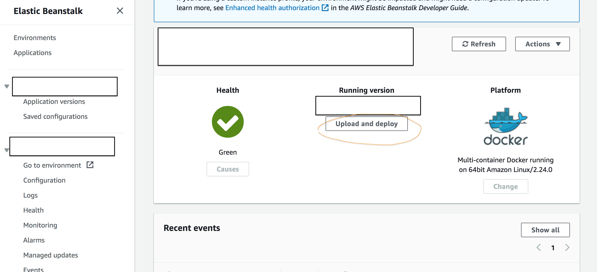
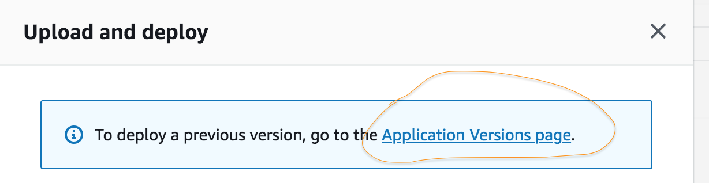
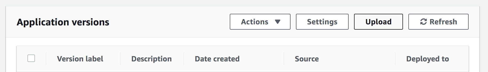
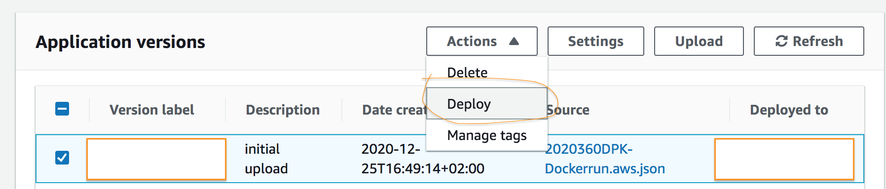
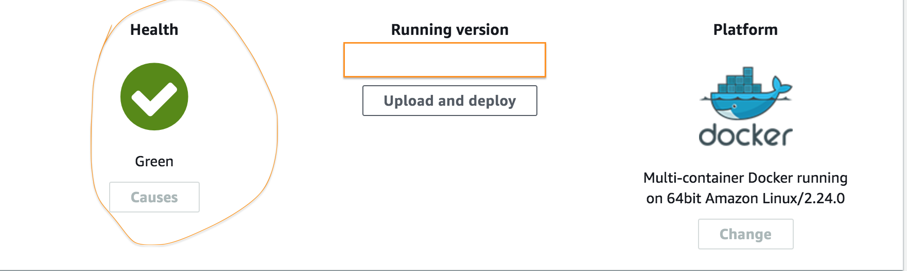

Dockerizing applications has become the norm: it allows for easy, reproducible deploys on numerous CI/CD platforms. A common workflow is to push docker images to a docker registry, for example, [Docker Hub](https://hub.docker.com) which is free, then have the deployment platform pull the image from the registry and deploy it. In this article I will explain how to deploy a dockerized application to [Elastic Beanstalk (EB)](https://aws.amazon.com/elasticbeanstalk/) which is an Amazon Web Services (AWS) platform used to manage docker containers. The article assumes you already have an AWS account. If you don't you can [create](https://aws.amazon.com/free/?all-free-tier.sort-by=item.additionalFields.SortRank&all-free-tier.sort-order=asc) one for free.

### Docker Hub Setup <a name="dockerhub"></a>

The information on how to push a docker image to Docker Hub can be found [here](https://docs.docker.com/docker-hub/repos/). Once your image is pushed, we can proceed to EB setup.

### Initial EB Setup <a name="intialebssetup"></a>

The <a name="aws-setup-link" style="color: black;box-shadow: none;">instructions</a> from this [link](https://docs.aws.amazon.com/elasticbeanstalk/latest/dg/GettingStarted.CreateApp.html) explain how to set up a test app. This will greatly simplify the setup and we'll change the test app to our dockerized app later. It's important to select `Docker` as the platform and `Multi-container Docker running on 64bit Amazon Linux` as the platform branch. In the course of the setup an [EC2](https://aws.amazon.com/ec2/?ec2-whats-new.sort-by=item.additionalFields.postDateTime&ec2-whats-new.sort-order=desc) instance will be created as well. EC2 is an AWS service which provides a virtual machine where the Docker containers actually run. My instance was spun up as a t2.micro instance which has 1GB of RAM. It takes about 10-15 min until the instance is up.

### Allow EB to Pull Your Images from Docker Hub

The next step is to allow EB to connect to Docker Hub and pull the image of your application. This step is only required if your Docker Hub account is private. Docker Hub authentication details will be provided via `Dockerrun.aws.json`:

1. It depends on the OS you're using and it [could](https://www.oasisworkflow.com/accessing-private-docker-images-from-aws-elastic-beanstalk) be that running `docker login` will automatically generate `dockercfg` file for you, however on macOS this is not the case. I pulled a docker image which accepts Docker Hub credentials and generates the `dockercfg` file in the same directory where it was run (works on macOS and perhaps Linux as well.). First create a file `credentials.env` and paste the following details in it:

```
DOCKER_USERNAME=YOUR_DOCKER_HUB_USERNAME
DOCKER_PASSWORD=YOUR_DOCKER_HUB_PASSWORD
DOCKER_REGISTRY=https://index.docker.io/v1/
```

then run the following command:

```bash
docker run -it --rm \
   --env-file=credentials.env \
   -v "$(pwd):/opt/data/" \
   -v "/var/run/docker.sock:/var/run/docker.sock" \
   codeship/dockercfg-generator /opt/data/dockercfg
```

The format of the generated file may not be compliant with the format expected by EB as stated [here](https://docs.aws.amazon.com/AmazonECS/latest/developerguide/private-auth-container-instances.html):

> Newer versions of Docker create a configuration file as shown above with an outer auths object. The Amazon ECS agent only supports dockercfg authentication data that is in the below format, without the auths object.

Therefore, edit the generated file to have the following format:

```
{
  "https://index.docker.io/v1/": {
    "auth": "YOUR_AUTH_CODE",
    "email": "your@email.com"
  }
}
```

I renamed the file to `dockercfg`.

2. Upload the `dockercfg` File to S3

[S3](https://aws.amazon.com/s3/) is an AWS object storage service. In order for EB to access the `dockercfg` file it must be stored in S3. Because we used the [link](#aws-setup-link) to set up a test application an S3 bucket was already set up for us. Therefore, we can navigate to S3 in AWS console and select the bucket with `elasticbeanstalk` in its name. I created a folder called `config` in which I uploaded the `dockercfg` file. Make sure that the S3 region corresponds to the region selected for EB and follow the instructions in this [link](https://console.aws.amazon.com/iam/home#/roles) in order to make sure that `aws-elasticbeanstalk-ec2-role` role has the `s3:GetObject` permission. In my case I had the permission policy `AWSElasticBeanstalkWebTier` in EB role by default which already contains the permission (this role should be created during the intial [setup](#aws-setup-link)).

## Create Dockerrun.aws.json

The EB equivalent of docker-compose.yml is a configuration file called `Dockerrun.aws.json`. Specifically [version 2](https://docs.aws.amazon.com/elasticbeanstalk/latest/dg/create_deploy_docker_v2config.html) of the file should be used with multi-container EB platform. Below is a sample configuration:

```json
{
  "AWSEBDockerrunVersion": 2,
  "authentication": {
    "bucket": "your_bucket_name",
    "key": "config/dockercfg"
  },
  "containerDefinitions": [
    {
      "name": "api",
      "image": "dockerhubuser/image:version",
      "memory": 256,
      "essential": true,
      "environment": [
        {
          "name": "YOUR_ENVIRONMENT_VARIABLE_NAME",
          "value": "YOUR_ENVIRONMENT_VARIABLE_VALUE"
        }
      ],
      "portMappings": [
        {
          "hostPort": 80,
          "containerPort": 8001
        }
      ]
    }
  ]
}
```

The `authentication` field points EB to the `dockercfg` file with Docker Hub authentication details. An array of runtime environment variables may be specified under `environment` field. Finally `portMappings` maps host port to container port. Once the configuration file is created it can be uploaded to EB via AWS console: go to Elastic Beanstalk and click on "Upload and deploy":



then click on "Application Versions page" on the pop-up window:


finally click "Upload":


and select the configuration file in the format of `Dockerrun.aws.json` as the above sample, and give it a name under version label. Once the new configuration was uploaded select the corresponding checkbox and click "Deploy":



EB will start the deploy of your application which will take a few minutes. In my case a load balancer was configured in EC2 for the application as well. It is worth noting that load balancer will perform health checks on your app by making a GET http request to `/` route on port `80` by default. If the application doesn't respond the enviroment health icon will become red and the application will not accept any other network requests until load balancer receives a valid response from the application.



There're 2 options in such case: either create a health check route in your server application or [remove](https://docs.aws.amazon.com/elasticloadbalancing/latest/application/load-balancer-delete.html) the load balancer (which is a paid service unless you're in free tier and plan to use it less than the quota).

Your application is now live 🔥!
