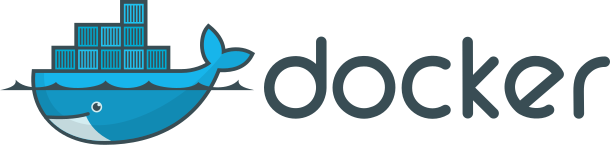

<div style="display:flex;align-items:center;padding-left:10%;padding-right:10%;padding-bottom: 120px;">
    <div style="width:20%;">
        
    </div>
    <div style="width:20%;padding-left: 16px;">
    </div>
        <span style="font-size: 32px;padding-left:16px;padding-right:16px;">macOS</span>
    </div>
    
</div>

I recently came across this really cool project called [lima](https://github.com/AkihiroSuda/lima). This is the project description as per the project itself:

> Lima launches Linux virtual machines with automatic file sharing, port forwarding, and containerd.

Let's break the description apart:

1. "automatic file sharing, port forwarding" - this is very handy if for example you want to test your app build on Linux but your main development environment is on another OS, like macOS. This is also handy if some actions can be more easily done on Linux ([more on that later](#moreonthat)).

2. [containerd](https://github.com/containerd) is an industry-standard container runtime. It's used by Docker and Kubernetes in order to push/pull images, manage storage, networking etc. In particular if you take a look at containerd [nerdctl](https://github.com/containerd/nerdctl#whale-nerdctl-run) command you will notice almost identical API to the familar Docker CLI commands (e.g. `run`, `build`).

The first point is achieved by using ssh for port forwarding and file sharing ([link](https://github.com/AkihiroSuda/sshocker)).

Lima is very easy to install following the [instructions](https://github.com/AkihiroSuda/lima). Once it's installed first you need to start lima:

```bash
limactl start
```

Now any given command `x` that you wish to run on Linux, can be run from Mac by adding `lima` prefix. For example running the below command from Mac termianl:

```bash
lima uname -a
```

returns the ouput `Linux lima-default 5.11.0-17-generic #18-Ubuntu SMP Thu May 6 20:10:11 UTC 2021 x86_64 x86_64 x86_64 GNU/Linux`. In addition running the command `lima bash` opens a Linux terminal (if you're using Bash). I used to have a [VirtualBox](https://www.virtualbox.org) instance on my Mac specifically so that I can run Linux but Lima is so much better! Configuring file sharing in VirtualBox is a big deal while in Lima you get it out of the box with zero configuration (of course if you need Linux GUI then Lima is not a real substitute for VirtualBox but in my case I don't need a Linux GUI).

<a name="moreonthat"></a>A quite interesting application of Lima can be simplified workflow with (Docker) containers. For example, suppose you're developing some service which accesses a server or database, and the service is run inside a container while the server or database run on host OS. In order to access the host server the container would need to be run with `--net=host` option. This will work on Linux but because Docker runs on top of a virtual machine on macOS, `--net=host` option will solely expose the virtual machine ports but that's not what you really want. For development purposes containers can refer to the `localhost` of the host network via `host.docker.internal` address. However, this often requires code changes in the service itself which is not ideal.

Using Lima can solve this problem because containers can be spun off on Linux via Lima and thus be able to use `--net=host` option. Below is the demonstration:

1. `lima nerdctl run --rm -it -p 8080:80 nginx:alpine` - this opens an nginx server on Linux host port `8080`.
2. In order to simulate Linux host port access from within a container the following Dockerfile can be used:

```docker
FROM alpine
RUN apk --no-cache add curl
CMD curl localhost:8080
```

3. `lima nerdctl build -t curltest .` - build the test container.
4. `lima nerdctl run --rm -it --net=host curltest:latest` - runs the container and outputs the html from nginx.

In conclusion, I think Lima is a great project which provides headless Linux with simple file-sharing and containerd service.
