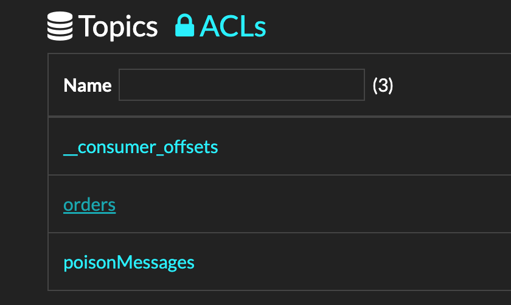

<div style="display:flex;justify-content:center;padding-right:10%;padding-bottom:50px;padding-top:30px;">
    
</div>

1. [What is Dapr/Why Dapr?](#why)
2. [Installing Dapr](#installing-dapr)
3. [Setting Up Redis Pub/Sub](#redis-pub-sub)
4. [Setting Up Kafka Pub/Sub](#kafka-pub-sub)
5. [Bonus](#bonus)
6. [References](#references)

### <a name="why"></a>What is Dapr/Why Dapr?
[Dapr](https://dapr.io) is an amazing open-source project which was initially started at Microsoft and is now part of Cloud Native Computing Foundation which abstracts away a lot of the implementation details of various infrastructure technologies when developing your application.

For example, say you have two microservices and you want to connect them via a message queue. Depending on the queue implementation chosen you will need to develop the necessary infrastructure. This process can be non-trivial if your company or team is small and mainly it distracts from the real purpose: developing the business logic of your application.

Dapr provides a runtime and SDK/connectors to such infrastructure technologies and more. For example, using Dapr SDK you can use Redis Streams/Kafka/AWS SQS/Rabbit MQ/Azure Service Bus message queues and many more. In addition to queues Dapr also streamlines secret management, telemetry between services, state management and [much more](https://dapr.io).

In the tutorial below I will show how to set up a simple pub/sub integration using Dapr first using Redis Streams then using Kafka, with both integrations using [dead letter queues](https://en.wikipedia.org/wiki/Dead_letter_queue) - destinations where messages are sent when they couldn't be processed successfully. The tutorial uses the official Dapr quickstarts [repo](https://github.com/dapr/quickstarts) as the basis.

### <a name="installing-dapr"></a>Installing Dapr

**Prerequisites:** Docker runtime.

Dapr can be run in several ways including as a Kubernetes sidecar but for the sake of the tutorial it will be easiest to run it via Docker containers. First, we need to install [Dapr CLI](https://docs.dapr.io/getting-started/install-dapr-cli/). Once the CLI is installed run `dapr init` and refer to the [docs](https://docs.dapr.io/getting-started/install-dapr-selfhost/) for any issues. After running `docker ps` you should see 3 new containers: `dapr_placement` which is the Dapr runtime itself, `dapr_redis` and `dapr_zipkin` for tracing.

### <a name="redis-pub-sub"></a>Setting Up Redis Pub/Sub
The next step is to set up a Java Spring Boot project which will use Dapr for pub/sub messaging between its services. You can clone the [repo](https://github.com/yossisp/dapr-pubsub-with-dlq-demo) I specifially created for this tutorial: `git clone https://github.com/yossisp/dapr-pubsub-with-dlq-demo.git` which already contains all the code we'll need. Below is the repo structure:
```
.
├── components-kafka
├── components-redis
├── docker-compose.yml
└── java
```
where components folders contain Dapr settings, `docker-compose.yml` contains Kafka broker + UI tool services and `java` folder contains the business logic code. Business logic applications can interact with Dapr runtime declaratively using Dapr YAML settings files or programmatically. In this tutorial we'll use the declarative approach. Let's take a look at `components-redis` folder:
```
.
├── dlq-subscription.yaml
├── observability.yaml
├── pubsub-subscription.yaml
└── pubsub.yaml
```
`pubsub.yaml` is a Dapr component of type `pubsub.redis`:
```yaml
apiVersion: dapr.io/v1alpha1
kind: Component
metadata:
  name: orderpubsub
spec:
  type: pubsub.redis
  version: v1
  metadata:
  - name: redisHost
    value: localhost:6379
  - name: redisPassword
    value: ""
```
`pubsub-subscription.yaml` is of type subscription and defines subscription settings:
```yaml
apiVersion: dapr.io/v1alpha1
kind: Subscription
metadata:
  name: order
spec:
  topic: orders
  route: /orders
  pubsubname: orderpubsub
  deadLetterTopic: deadLetterTopic
```
It defines `orders` stream in Redis (Redis Docker container was created by `dapr init`) whose messages will be delivered to our application via `/orders` server endpoint. That is Dapr will communicate with the message queue while the actual application will receive messages via a REST endpoint. It also defines a dead letter topic called `deadLetterTopic`. Whenever an error will occur when processing some message this message will be forwarded to this topic, more specifically to `/failedMessages` endpoint as defined in `dlq-subscription.yaml`.

Our Java application is composed of two services: checkout and order-processing component. Checkout component generates and publishes messages while order-processing component subscribes to the topics and receives the messages. Below is the order-processing component code:
```java
package com.service.controller;

import io.dapr.Topic;
import io.dapr.client.domain.CloudEvent;

import lombok.Getter;
import lombok.Setter;
import org.springframework.http.MediaType;
import org.springframework.http.ResponseEntity;
import org.springframework.web.bind.annotation.*;

import org.slf4j.Logger;
import org.slf4j.LoggerFactory;

@RestController
public class OrderProcessingServiceController {

    private static final Logger logger = LoggerFactory.getLogger(OrderProcessingServiceController.class);
    private static final int MESSAGE_NUM_TO_THROW_ON = 2;

    @PostMapping(path = "/orders", consumes = MediaType.ALL_VALUE)
    public ResponseEntity getCheckout(@RequestBody(required = false) CloudEvent<Order> cloudEvent) {
        try {
            logger.info("Orders subscriber message received: " + cloudEvent.getData().getOrderId());
            if (cloudEvent.getData().getOrderId() == MESSAGE_NUM_TO_THROW_ON) {
                throw new RuntimeException("some error");
            }
            return ResponseEntity.ok("SUCCESS");
        } catch (Exception e) {
            throw new RuntimeException(e);
        }
    }

    @PostMapping(path = "/failedMessages", consumes = MediaType.ALL_VALUE)
    public ResponseEntity failedMessages(@RequestBody(required = false) CloudEvent<Order> cloudEvent) {
        try {
            logger.info("failedMessages subscriber message received: " + cloudEvent.getData().getOrderId());
            return ResponseEntity.ok("SUCCESS");
        } catch (Exception e) {
            throw new RuntimeException(e);
        }
    }
}

@Getter
@Setter
class Order {
    private int orderId;
}
```
It's a very simple Spring Boot MVC with two controllers: `/orders` and `/failedMessages`. Checkout service will send 11 messages, on the 3rd message an error will occur inside `/orders` controller which will result in the message being sent to the dead letter queue to `/failedMessages` controller. We'll generate the Java jars and start the services:

- Checkout service
```bash
cd java/sdk/checkout
mvn clean install
dapr run --app-id checkout --components-path ../../../components-redis -- java -jar target/CheckoutService-0.0.1-SNAPSHOT.jar
```
- Order-processing service
```bash
cd java/sdk/order-processor
mvn clean install
dapr run --app-port 8080 --app-id order-processor --components-path ../../../components-redis -- java -jar target/OrderProcessingService-0.0.1-SNAPSHOT.jar 2>&1 | tee log
```

The output of order-processing service is saved into the file `java/sdk/order-processor/log` which we can search for log messages. We can see that each message first arrives to the `/orders` controller via `Orders subscriber message received` logs. And the `failedMessages subscriber message received` log tells us that one message wasn't successfully processed and therefore arrived to `/failedMessages` controller.

--------

So far great! Using Dapr SDK and runtime we implemented a pub/sub infrastructure backed by Redis Streams in no time 🔥. On top of that we have dead letter queue functionality without writing a single line of Java code.

Now suppose that our requirements changed and we want to use Kafka as our message queue of choice. Usually, this would result in a time-consuming new integration and possibly code refactor. But using Dapr it's just a matter of creating a new YAML configuration.

### <a name="kafka-pub-sub"></a>Setting Up Kafka Pub/Sub
In order to use Kafka for pub/sub we can use the configurations defined under `components-kafka` directory. The component type is now `pubsub.kafka` along with some other Kafka-specific settings as can be seen in `pubsub.yaml`:
```yaml
apiVersion: dapr.io/v1alpha1
kind: Component
metadata:
  name: orderpubsub
spec:
  type: pubsub.kafka
  version: v1
  metadata:
    - name: brokers # Required. Kafka broker connection setting
      value: "localhost:9092"
    - name: consumerGroup # Optional. Used for input bindings.
      value: "group1"
    - name: clientID # Optional. Used as client tracing ID by Kafka brokers.
      value: "my-dapr-app-id"
    - name: authType # Required.
      value: "none"
    - name: maxMessageBytes # Optional.
      value: 1024
    - name: consumeRetryInterval # Optional.
      value: 200ms
    - name: disableTls # Optional. Disable TLS. This is not safe for production!! You should read the `Mutual TLS` section for how to use TLS.
      value: "true"
    - name: initialOffset
      value: "oldest"
```
The rest of the files: `pubsub-subscription.yaml`, `dlq-subscription.yaml` and `observability.yaml` remain the same.

First, we need to start `docker-compose.yml` to have a Kafka broker up: run `docker-compose up` from the root directory. This will spin up a Kafka broker as well as a Kafka UI tool which will allow up to peek at the messages. Now the services can be invoked again with the only change being components folder:

- Checkout service
```bash
cd java/sdk/checkout
dapr run --app-id checkout --components-path ../../../components-kafka -- java -jar target/CheckoutService-0.0.1-SNAPSHOT.jar
```
- Order-processing service
```bash
cd java/sdk/order-processor
dapr run --app-port 8080 --app-id order-processor --components-path ../../../components-kafka -- java -jar target/OrderProcessingService-0.0.1-SNAPSHOT.jar 2>&1 | tee log
```

We can verify through the logs that the same scenario occurred as when using Redis Streams: all messages passed through `/orders` controller while one message passed through `/failedMessages` controller. We can additionally verify this if we use Kafka UI tool at `localhost:9000`:


 and click `orders` or `poisonMessages` topics to see the list of messages.

 As you can see switching from Redis to Kafka was a breeze, not a single line of Java code changed 🚀. I hope this tutorial showcased one of the main strengths of Dapr: delegating infrastructure code to its runtime and SDK and the ability to switch infrastructure providers seamlessly without any Java code changes. [Link](https://github.com/yossisp/dapr-pubsub-with-dlq-demo) to the full code.

 ### <a name="bonus"></a>Bonus
 Dapr provides observability via [Zipkin](https://zipkin.io/). If you ran `dapr init` at the beginning of the tutorial, go to `localhost:9411` which is Zipkin UI and hit `Run query` to see that each message generated a trace.

 Also Dapr provides a nice dashboard where all services can be viewed, run this in Terminal: `dapr dashboard -p 8081` to explore.

 ### <a name="references"></a>References
 1. [Initialize Dapr in your local environment](https://docs.dapr.io/getting-started/install-dapr-selfhost/)
 2. [Quickstart: Publish and Subscribe](https://docs.dapr.io/getting-started/quickstarts/pubsub-quickstart/)
 3. [List of Dapr-supported pub/sub brokers](https://docs.dapr.io/reference/components-reference/supported-pubsub/)
 4. [Dead Letter Topics in Dapr](https://docs.dapr.io/developing-applications/building-blocks/pubsub/pubsub-deadletter/)
 5. [Dapr Declarative and programmatic subscription methods](https://docs.dapr.io/developing-applications/building-blocks/pubsub/subscription-methods/)
 6. [Dapr pub/sub integration with Apache Kafka](https://docs.dapr.io/reference/components-reference/supported-pubsub/setup-apache-kafka/)