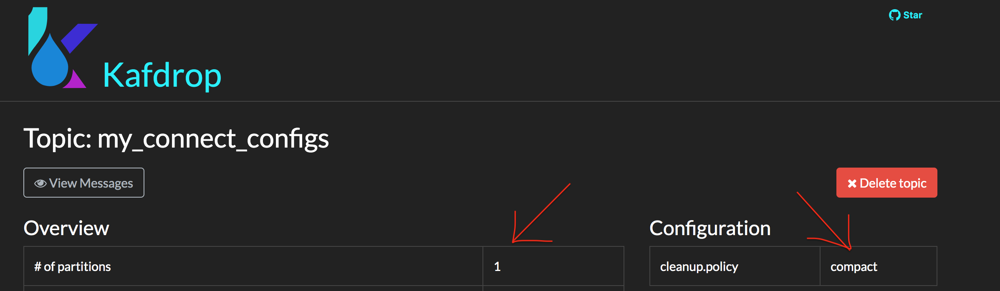
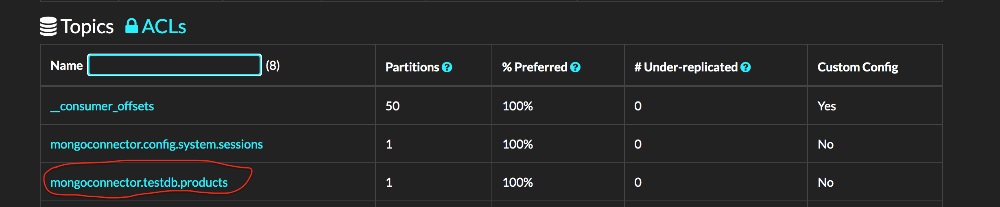
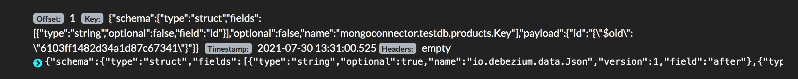

<div style="display:flex;align-items:center;padding-left:10%;padding-right:10%;padding-bottom:32px;">
    <div style="width:30%;">
        
    </div>
        <span style="font-size: 64px;padding-left:16px;padding-right:32px;">+</span>
    <div style="width:30%;padding-top:32px;">
    
    </div>
</div>

1. [Why I chose Kafka to stream changes to Elasticsearch.](#why)
2. [Take me straight to the tutorial.](#tutorial)

<a name="why"></a>I recently had to stream all changes (insertions/updates/deletions) from MongoDB to Elasticsearch in order to allow users to search the most up-to-date data. In addition I needed to transform MongoDB documents before inserting them into Elasticsearch, and many of those transformations weren't trivial. There're several options to do this which include [Logstash](https://www.elastic.co/logstash/) and [MongoDB River Plugin for ElasticSearch](https://github.com/richardwilly98/elasticsearch-river-MongoDB). Logstash is an official component of ELK stack which is nice but it has its own syntax for modifying documents which requires a certain learning curve. MongoDB River plugin is an [Elasticsearch plugin](https://www.elastic.co/guide/en/elasticsearch/reference/current/modules-plugins.html) which also allows document [transformations](https://github.com/richardwilly98/elasticsearch-river-MongoDB/wiki) although it seems that the transformations are more along the likes of including/excluding specific fields in a document. It also requires a relatively complicated setup to enable transformations. All of the above solutions require MongoDB to be started as a replica set because then MongoDB creates a special collection called `oplog` under `local` database. The oplog contains all document changes from any collection and is therefore used by the tools above to monitor for MongoDB document changes.

There's also a 3rd option: Kafka connector! The advantage of Kafka connector is that it will stream document changes to a Kafka topic which can then be consumed by a Kafka client in a language of your choice. Once I have access to the changed document I can easily apply all the transformations I need using my programming language and then insert/delete the document into Elasticsearch. A popular connector for this use case is [Debezium](https://debezium.io/) which supports streaming changes from a number of databases including MongoDB. There's an official Debezium [tutorial](https://debezium.io/documentation/reference/1.6/connectors/MongoDB.html) for connecting to MongoDB but I'd like to share a more straightforward guide to performing the setup. While the tutorial is great and I encourage everyone to read it to get a better understanding of Debezium I think I can offer a simplified version of the tutorial which will also cover common pitfalls of the setup.

<a name="tutorial"></a>First of all:

> Debezium is built on top of Apache Kafka and provides Kafka Connect compatible connectors that monitor specific database management systems.

[Kafka Connect](https://kafka.apache.org/documentation/#connect) is an open-source tool to ingest data from data systems (e.g. databases) and to stream changes to data systems. When data is ingested a source connector is used, when data is streamed sink connector is used. Kafka connectors and by extension Debezium are managed via REST API.

Debezium also requires MongoDB to be run as a replica set. If you use a standalone Mondodb instance you can easily [convert](https://docs.MongoDB.com/v4.0/tutorial/convert-standalone-to-replica-set/) it to replica. I also had to convert mine and I'll use a minimal setup MongoDB docker image for the tutorial:

- create a file `mongoinit.sh` and paste the lines in it:

```bash
sleep 5 && mongo --eval "rs.initiate()" &
mongod --port 27017 --replSet rs0 --bind_ip_all
```

The shell script initiates a MongoDB replica set which will consist of one primary node.

- create a file named `Dockerfile.mongo` and paste the following lines in it:

```docker
FROM mongo:4.0
WORKDIR /src
COPY ./mongoinit.sh ./mongoinit.sh
RUN chmod +x ./mongoinit.sh
CMD ["./mongoinit.sh"]
```

- the mongo docker image can be built: `docker build -f Dockerfile.mongo -t mongo .`

Now that we have a custom MongoDB image we can create the `docker-compose.yml` file which will contain all the necessary parts we need for the project: a Kafka broker instance, MongoDB instance, Debezium instance and [Kafdrop](https://github.com/obsidiandynamics/kafdrop) instance which allows to browse Kafka topics/message via a web GUI:

```yml
version: "3"
services:
  kafdrop:
    image: obsidiandynamics/kafdrop
    restart: "no"
    ports:
      - "9000:9000"
    environment:
      KAFKA_BROKERCONNECT: "kafka:29092"
      JVM_OPTS: "-Xms16M -Xmx48M -Xss180K -XX:-TieredCompilation -XX:+UseStringDeduplication -noverify"
    depends_on:
      - "kafka"

  kafka:
    image: obsidiandynamics/kafka
    restart: "no"
    ports:
      - "2181:2181"
      - "9092:9092"
      - "29092:29092"
    environment:
      KAFKA_LISTENERS: "INTERNAL://:29092,EXTERNAL://:9092"
      KAFKA_ADVERTISED_LISTENERS: "INTERNAL://kafka:29092,EXTERNAL://localhost:9092"
      KAFKA_LISTENER_SECURITY_PROTOCOL_MAP: "INTERNAL:PLAINTEXT,EXTERNAL:PLAINTEXT"
      KAFKA_INTER_BROKER_LISTENER_NAME: "INTERNAL"
      KAFKA_ZOOKEEPER_SESSION_TIMEOUT: "6000"
      KAFKA_RESTART_ATTEMPTS: "10"
      KAFKA_RESTART_DELAY: "5"
      ZOOKEEPER_AUTOPURGE_PURGE_INTERVAL: "0"

    mongo:
      image: mongo
      container_name: mongo

    connect:
      image: debezium/connect:1.6
      ports:
        - 8083:8083
      environment:
        - BOOTSTRAP_SERVERS=kafka:29092
        - GROUP_ID=connect-cluster
        - CONFIG_STORAGE_TOPIC=my_connect_configs
        - OFFSET_STORAGE_TOPIC=my_connect_offsets
        - STATUS_STORAGE_TOPIC=my_connect_statuses
      depends_on:
        - "kafka"
        - "mongo"
```

Once the file is created `docker-compose up` can be run from the same directory as the file. Notice that Debezium configuration contains several environment variables which are Kafka Connect variables. They can be found in the [docs](https://kafka.apache.org/documentation/#connect) by their namesakes: `config.storage.topic`, `offset.storage.topic`, `status.storage.topic` etc. These topics require specific configuration which is mentioned in the [docs](https://kafka.apache.org/documentation/#connect). Debezium will attempt to auto create the topics if your Kafka broker allows it. You can check if the topics were created with Debezium required settings in Kafdrop at `localhost:9000`:



else the topics must be created manually with the required settings via a Kafka admin client of your choice.

What is left is to connect Debezium to MongoDB. Firstly, Debezium requires a certain set of permissions to access oplog collection. A user can be created for this purpose in mongo shell. Run `docker exec -it mongo /bin/bash`. Once inside the container execute `mongo` command to start mongo shell. Run the following command:

```js
use admin
db.createUser(
  {
    user: 'your_username',
    pwd: 'your_password',
    roles: [ { role: 'root', db: 'admin' } ]
  }
);
```

Now a Debezium connector needs to created via Kafka Connect REST API (below is a CURL command which can be executed in terminal):

```bash
curl --location --request POST 'http://localhost:8083/connectors' \
--header 'Content-Type: application/json' \
--data-raw '{
  "name": "mongo",
  "config": {
    "connector.class": "io.debezium.connector.MongoDB.MongoDBConnector",
    "MongoDB.hosts": "mongo:27017",
    "MongoDB.name": "mongoconnector",
    "MongoDB.user": "your_username",
    "MongoDB.password": "your_password",
    "MongoDB.authsource": "admin"
  }
}'
```

The keys in the POST body JSON object are Debezium [properties](https://debezium.io/documentation/reference/1.6/connectors/MongoDB.html#MongoDB-connector-properties). `monngodb.hosts` value is `mongo:27017` because both Debezium and MongoDB are run inside docker containers and docker allows one docker service to refer to another service via `servicename:port` convention (provided that the containers are on the same docker network which they are in our case because docker-compose automatically creates one). Because the name of the MongoDB service is `mongo` and the database runs on port `27017` it can be accessed on the network by `mongo:27017` address.

Let's create some data in the same mongo shell that we opened earlier:

```js
use testdb
db.products.insert({ item: "envelopes", qty: 100, type: "Clasp" })
```

After visiting Kafdrop at `localhost:9000` the `mongoconnector.testdb.products` topic should appear:



After clicking the topic a message will be seen which will contain data referring to the document just created:



The created document can be accessed under the Kafka message value `payload.after` key for insertions and under `payload.patch` key for updates.

At this point a Kafka consumer can be started to consume messages from `mongoconnector.testdb.products` topic, perform the necessary transformations and insert the resulting documents into Elasticsearch (🔥).
