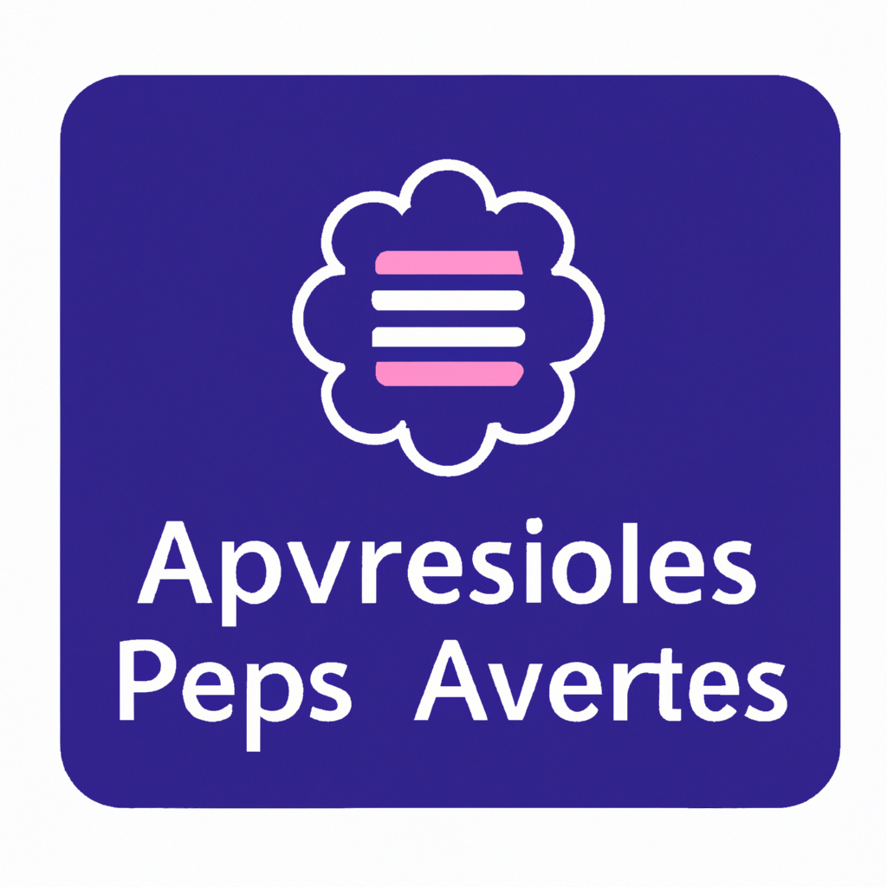
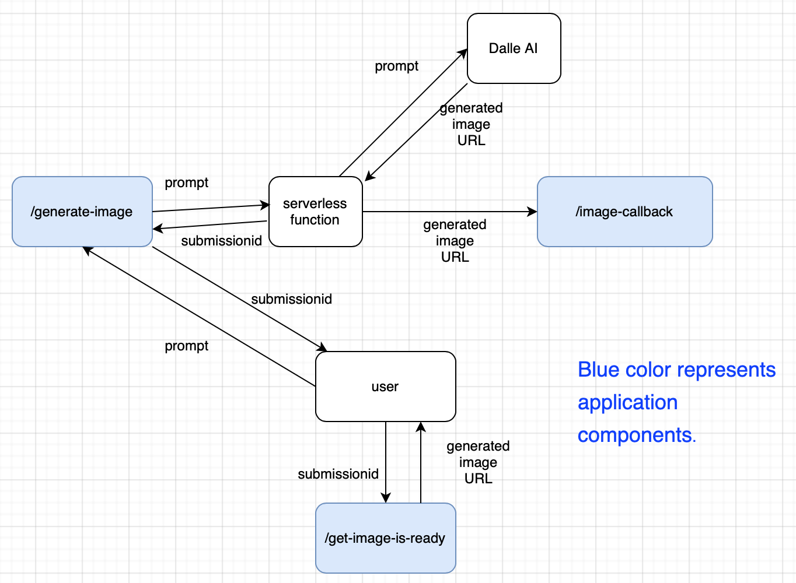

<div style="font-size:14px;font-style:italic;color:gray;padding-bottom:64px;">The above image was generated by <a href="https://openai.com/dall-e-2/">Dalle2</a> AI image generation service for the prompt: "logo for application using serverless functions and artificial intelligence api".</div>

1. [Why Use Serverless When Working With AI Services?](#why-serverless)
2. [Serverless Solution](#solution)
3. [Qstash Showcase](#qstash)
4. [Link To Code](#link-to-code)

Given the current boom of AI technologies one thing to keep in mind is that API responses from large AI models can be [slow](https://community.openai.com/t/open-ai-reponse-is-slow/22527) especially given large prompts, sometimes even spanning minutes.

### <a name="why-serverless"></a>Why Use Serverless When Working With AI Services?
Long response time from AI services can present a challenge if your application makes a lot of concurrent requests to an AI service like [ChatGPT](https://openai.com/blog/chatgpt/) and especially to image generation services like [Dalle](https://openai.com/dall-e-2/) or [Midjourney](https://midjourney.com/home/?callbackUrl=%2Fapp%2F). While you're less likely to run into [C10k problem](https://en.wikipedia.org/wiki/C10k_problem) with modern machines it can still result in issues like:

- timeouts (your client/service mesh provider may time out)
- high memory consumption: holding a high number of concurrent HTTP connections will result in higher memory consumption or even memory leaks

A very elegant solution to the above problems is to use a serverless function, essentially delegate the "waiting time" to a serverless service and have the serveless function forward AI service response to a callback endpoint in your application. I first ran into this approach in this Github [project](https://github.com/domeccleston/dalle-2) which includes an example for a [Next.js](https://nextjs.org) application. 

### <a name="solution"></a>Serverless Solution
The diagram below shows an example for a server application which receives a request with some prompt, uses serverless service to forward the request to OpenAI [Dalle](https://openai.com/dall-e-2/) image generation API and allows the user to check if their image is ready:



The flow is:

- The user sends a request to `/generate-image` with the prompt which describes the image to generate. The user response includes submission id which the user will use later to check if their image is ready.
- The application passes the prompt to a serverless provider.
- Serverless provider makes a request to Dalle with the prompt and forwards the response to `/image-callback` callback in the application.
- The application saves the URL to the generated image in some kind of storage service (in a real application a service like [Redis](https://redis.io/) could be used) along with the submission id as the key.
- The user can check if the image is ready from time to time via `/get-image-is-ready` endpoint. In a real application, the application itself could be polling the cache to check if the image was generated and notify the user via some kind of an event like Websocket communication/[server-side events](https://developer.mozilla.org/en-US/docs/Web/API/Server-sent_events/Using_server-sent_events), HTTP/2 which allows bidirectional streaming or message queues. An alternative to polling would be to save the data in a database like Postgres and then use a change data capture project like [Debezium](https://debezium.io/) to send an event to the application once new data with image URL was inserted (you can check out my blog [post](https://www.spektor.dev/how-to-stream-postgres-mysql-changes-to-elasticsearch-via-kafka/) which details this setup).

### <a name="qstash"></a>Qstash Showcase
What I'd like to showcase in this post is the serverless solution using [Qstash](https://docs.upstash.com/qstash) by Upstash. Upstash is a cloud service which provides [Redis](https://redis.io/) and [Kafka](https://kafka.apache.org/) as a service with free tiers. In addition, it provides a serverless solution similar to [AWS Lambda](https://aws.amazon.com/lambda/) called [Qstash](https://docs.upstash.com/qstash). What's really cool about it is the simplicity of usage. For example, in the tutorial we want to make a request to OpenAI API `https://api.openai.com/v1/images/generations`. This is how the request would look like using Qstash:
```bash
curl -XPOST \
    -H 'Authorization: Bearer QSTASH_TOKEN' \
    -H 'Upstash-Forward-My-Custom-Header: my-value' \
    -H 'Upstash-forward-Authorization: Bearer OPENAI_API_KEY' \
    -H 'Content-type: application/json' \
    -H 'Upstash-Callback: myapp.com/callback' \
    -H 'Upstash-Retries: 3' \
    -d '{ "prompt": "some prompt" }' \
    'https://qstash.upstash.io/v1/publish/https://api.openai.com/v1/images/generations'
```

Let's break down the request, there's a lot going on here:
- `https://qstash.upstash.io/v1/publish/https://api.openai.com/v1/images/generations`: in order to have Qstash pass the request to OpenAI all we had to do was to concatenate the two URLs (!). That is `https://qstash.upstash.io/v1/publish` + the destination URL.
- `Authorization: Bearer QSTASH_TOKEN` pass Qstash access token.
- We can pass any custom headers to OpenAI via `Upstash-Forward-My-Custom-Header`. For example, in order to pass OpenAI API key we used `Upstash-forward-Authorization: Bearer OPENAI_API_KEY`.
- `Upstash-Callback: myapp.com/callback` header defines the callback URL that Qstash should forward the OpenAI response to.
- `Upstash-Retries: 3` how many times should Qstash retry the request.
- `{ "prompt": "some prompt" }` body payload to be sent to destination service (OpenAI).

In my opinion the simplicity of usage is amazing 🔥. What's even greater is that you can even create a CRON job using Qstash by making a request as above and adding this header `Upstash-Cron: 0 1 * * *`. This could be very handly if you want to access some external API at an interval and save its response without having to orchestrate CRON job in your application code.

### <a name="link-to-code"></a>Link To Code
You can find the full Typescript code for the application described in the post in this Github [repo](https://github.com/yossisp/async-ai-image-generation). 