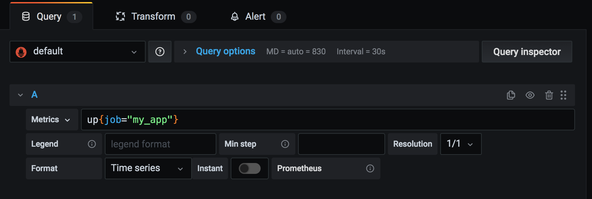
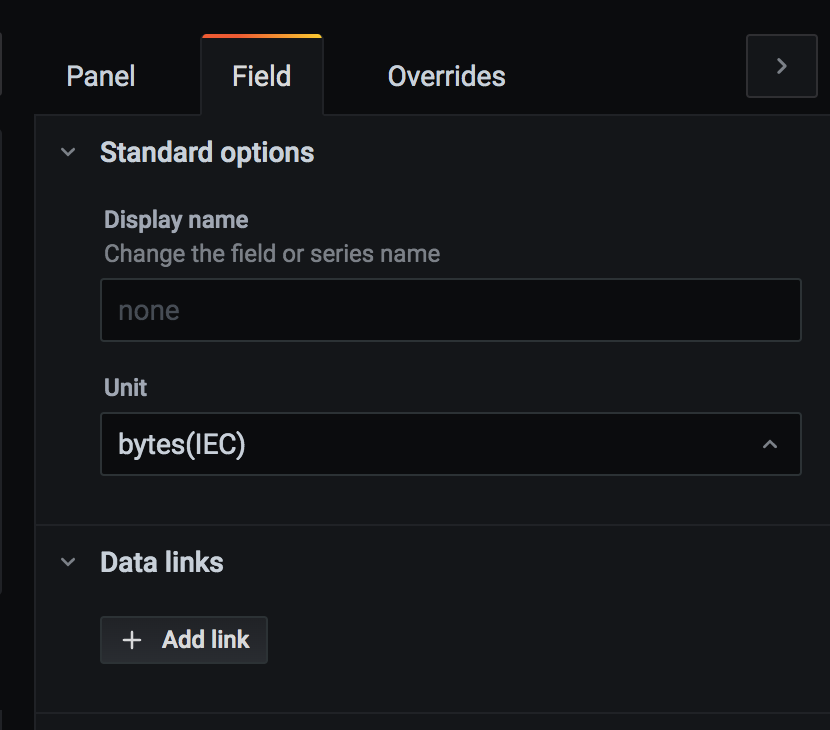

<div style="display:flex;align-items:center;padding-left:10%;padding-right:10%;padding-bottom:50px;">
    <div style="width:30%;">
        
    </div>
        <span style="font-size: 32px;padding-left:16px;padding-right:16px;"> + </span>
    <div style="width:30%;">
    
    </div>
</div>

_The link to the github repo with the code:_ [link](https://github.com/yossisp/prometheus-grafana-tutorial).

[Prometheus](https://prometheus.io) is an open-source project which is both a monitoring system and a time-series database. It's a popular choice for monitoring services, for example, it can be used to monitor metrics like CPU usage, heap consumption as well as business logic events (more on that later). Its time-series database also supports labels (e.g. metrics can be classified for example by mobile/desktop, client type etc.). Additional features include:

- PromQL language which can be used to query for certain metrics/labels/perform aggregations etc.
- Alerts

Prometheus uses pull model to get metrics data. This means that a server runs on the same hardware as your application and exposes a REST endpoint which Prometheus instance makes requests to, based on the set interval (by default 15 seconds). Push model is also supported however it's recommended only for very specific scenarios when pulling model may miss the actual events (for example missing a rare business logic event).

[Grafana](https://grafana.com/) is an open-source project which provides great visualizations for projects like Prometheus. There's a nice Grafana tutorial [here](https://grafana.com/tutorials/grafana-fundamentals/).

Below I will show how to set up Prometheus, Grafana and a simple server application in order to visualize Prometheus data. Full code of the app can be found [here](https://github.com/yossisp/prometheus-grafana-tutorial). First let's create a very simple NodeJS server app. It will implement `/metrics` route which will return metrics in Prometheus format using [prom-client NPM package](https://www.npmjs.com/package/prom-client) (by default Prometheus pulls from `/metrics` endpoint but this can be changed) and `/home` route which would contain business logic:

```ts
import express, { Request, Response } from "express"
import promClient from "prom-client"

const main = () => {
  const app = express()

  // collect default metrics like CPU/heap/event loop stats
  promClient.collectDefaultMetrics()
  app.get("/metrics", async function(req: Request, res: Response) {
    const metrics = await promClient.register.metrics()
    res.set("Content-Type", promClient.register.contentType)
    res.send(metrics)
  })

  app.get("/home", function(req: Request, res: Response) {
    // business logic
    res.send("Hello World!")
  })
  app.listen(3000)
  console.log("Server started on port 3000")
}

main()
```

Supposing the app is running locally at `localhost:3000` if we access the app at endpoint `localhost:3000/metrics` the following response will be received (only 2 metrics are displayed for brevity, the actual output contains more):

```
# HELP process_cpu_user_seconds_total Total user CPU time spent in seconds.
# TYPE process_cpu_user_seconds_total counter
process_cpu_user_seconds_total 0.017604

# HELP process_resident_memory_bytes Resident memory size in bytes.
# TYPE process_resident_memory_bytes gauge
process_resident_memory_bytes 32145408
```

As can be seen one of the metrics is called `process_cpu_user_seconds_total` and its value is `0.017604`. `HELP` explains the meaning of the metric while `TYPE` mentions the type of the metric which is a counter. Prometheus supports several types of metrics 2 of which will be covered in the post:

- **Counter** is used for always increasing values e.g. total user CPU time spent in seconds. As long as our app is active this value will only increase. A counter will also be suitable to track the number of requests a server received as it will only increase.

- **Gauge** is used for values which increase and decrease. For example, heap consumption or number of active users.

For the purposes of the tutorial we'll create a custom counter: the number of requests to `/home` route:

```ts
import express, { Request, Response } from "express"
import promClient from "prom-client"

const main = () => {
  const app = express()
  const homeRequestsNumCounter = new promClient.Counter({
    name: "home_requests_num",
    help: "Number of requests to /home route",
  })

  // collect default metrics like CPU/heap/event loop stats
  promClient.collectDefaultMetrics()
  app.get("/metrics", async function(req: Request, res: Response) {
    const metrics = await promClient.register.metrics()
    res.set("Content-Type", promClient.register.contentType)
    res.send(metrics)
  })

  app.get("/home", function(req: Request, res: Response) {
    // business logic
    homeRequestsNumCounter.inc()
    res.send("Hello World!")
  })
  app.listen(3000)
  console.log("Server started on port 3000")
}

main()
```

The line `homeRequestsNumCounter.inc()` increments the custom counter each time a new request for `/home` is received. Let's make a request to `localhost:3000/home` so that when we get Prometheus stats at `localhost:3000/metrics` we can receive the following:

```
# HELP home_requests_num Number of requests to /home route
# TYPE home_requests_num counter
home_requests_num 1
```

Great! Now what is left is containerize our server and add `prometheus.yml` config. Prometheus supports [targets auto-discovery](https://prometheus.io/docs/prometheus/latest/http_sd/) however for simplicity purposes the connection details of our app target can be configured in a configuration file `prometheus.yml`:

```yaml
global:
  scrape_interval: 15s

scrape_configs:
  - job_name: "my_app"

    static_configs:
      # the address is `myapp:3000` because the application
      # will be run within docker-compose as `myapp` service
      - targets: ["myapp:3000"]
```

Full setup including the application code and `docker-compose.yml` can be found [here](https://github.com/yossisp/prometheus-grafana-tutorial). If `docker-compose up` is run three services are available:

- the application server
- Prometheus
- Grafana

Let's access Grafana at `localhost:3001`, the initial username and password are `admin`:

- First, a datasource needs to be created in our case it will be Prometheus. Go to `localhost:3001/datasources`, click `Add data source`, select Prometheus whose URL should be `prometheus:9090` and click `Save & Test`.
- Now a dashboard for our application can be created. Go to `localhost:3001/dashboard/new?orgId=1` and click `Add new panel`:

  

Under metrics enter `up{job="my_app"}`. Each Prometheus target is called a job and the query returns `0` if the application is not responding, else it returns `1`. The job can contain multiple targets, for example, there could be a producer and consumer microservice as part of the same job. `up` query is handy to set up an alert to notify if a service is down. This panel can be called `Uptime`.

- The next panel we'll create will be for a gauge metric `nodejs_heap_space_size_used_bytes`. Click `Add new panel`, set `Panel title` to `Heap Usage` and set the metrics field to `nodejs_heap_space_size_used_bytes{job="my_app"}`. This panel can be called `Heap Usage`. Go to `Field` menu and select bytes as field unit:

  

Now we can see the heap usage graph:


- The last metric we'll add is the custom counter `home_requests_num`. Create new panel, name it `/home requests num` and set the metrics query to be `home_requests_num{job="my_app"}`. After making a few requests to `/home` route this will produce the following graph:

  

Because counter metrics are always increasing such graph will not be very informative. That's why Prometheus provides `rate` and `irate` functions. `rate` calculates the per-second average rate of increase of the time series in the range vector. Let's set the metrics query to `rate(home_requests_num{job="my_app"}[5m]) * 60`:


The graph now indeed provides some insights, like for example that at 12:34 there was a spike in requests. By default `rate` function calculates the rate of increase per-second that's why in the query above the result is multiplied by 60 so that we see the stats per minute. In addition `[5m]` means that the rate of increase over the last 5 minutes will be calculated.

There's also `irate` function which calculates the per-second instant rate of increase of the time series in the range vector based on the last two data points. It can be used for metrics which have sudden spikes of activity (like CPU activity) which `rate` will smooth out because `rate` calculates an average over an interval which is usually a couple of minutes. In practice however because `irate` calculates rate of increase based only on the last two data points it can also miss the spike event. The query would be:

```
irate(home_requests_num{job="my_app"}[5m]) * 60
```

None of those functions is perfect. [This](https://utcc.utoronto.ca/~cks/space/blog/sysadmin/PrometheusSubqueriesForSpikes) post recommends using intervals to catch sudden spikes:

```
max_over_time((irate(home_requests_num{job="my_app"}[45s]))[$__interval:10s]) * 60
```

The problem with interval is that it currently [can't be used with alerts](https://github.com/grafana/grafana/issues/15168).

In Grafana multiple queries can be added in the same panel, so let's compare the results of rate/irate and interval query:


As can be seen in the screenshot both `irate` and interval show a sudden spike of requests more clearly than `rate`.

Regarding counters and gauges it can clearly be seen that counters are more complicated that gauges because rate functions are usually used to make counters meaningful. This means that if a metric can be represented as a gauge it certainly should be implemented as such.

I hope the above introduction to Prometheus and Grafana was helpful. I found [this](https://www.metricfire.com/blog/understanding-the-prometheus-rate-function/) link very helpful to better explain `rate` function, [this](https://valyala.medium.com/why-irate-from-prometheus-doesnt-capture-spikes-45f9896d7832) link explains `irate` in more detail while [this](https://utcc.utoronto.ca/~cks/space/blog/sysadmin/PrometheusRateVsIrate) article compares `rate` and `irate`.
