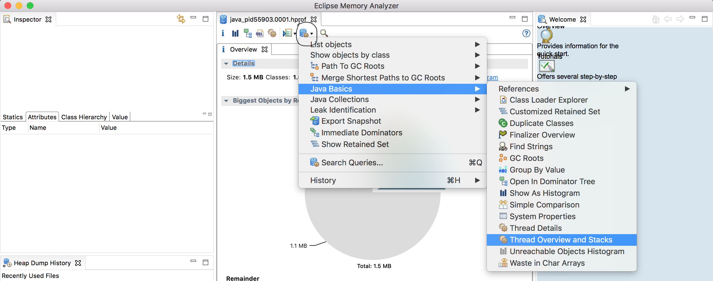
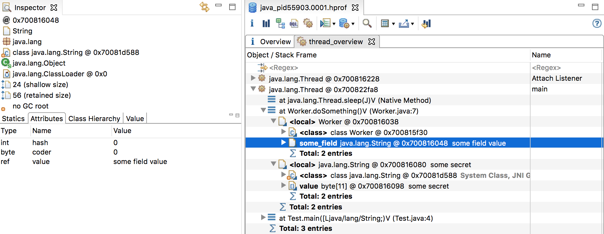
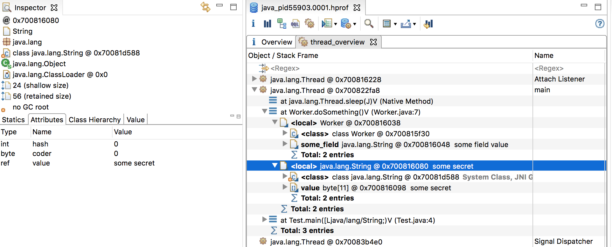

<div style="display:flex;justify-content:center;">
  <div style="width:50%;padding-top:32px;padding-bottom:52px;">
    
  </div>
</div>

<span style="color:orange;text-decoration: underline;font-size:24px;">TL;DR:</span>

1. If an attacker gains access to a deployment instance they can get access to secrets saved in memory by performing heap dump of the process.
2. Saving secrets to `char` arrays in Java can possibly mitigate the risk but not prevent it completely.

------

There're multiple ways to pass sensitive data (access tokens/passwords etc.) to an instance of an application deployment, for example:

- environment variables/files.
- using network (e.g. HTTPS requests) to get sensitive data.

Using network in theory is the safest method because the result of an HTTPS request which would return some secret is assigned to some variable in application memory so an attacker can't easily retrieve it from the memory as opposed to using environment variables because if someone gains access to the deployment machine, then printing environment variables is as easy as running `env` command in Linux.

However, in the case the attacker gained access to the machine where the application runs (e.g. via SSH) they can easily perform a heap dump of the application memory. **Heap dumps in Java for example will contain the names of class methods, instance fields name and their values, static fields name and their values.** In addition the values of stack (local) variables are available, although their names according to my checks are not available.

Production deployments of Java usually do not include JDK for security reasons but are rather run on JRE. Assuming JDK will not be present in the deployment machine, the attacker will not be able to use command-line utilities shipped with JDK to produce heap dumps like `jmap`. However, if the attacker has access to the deployment machine `jmap` can be used to connect remotely or it can be installed in the deployment machine by the attacker. The point is that if an attacker has access to the machine they can generate a heap dump. 

Let's look at an example Java application made up of two classes: `Test.java` and `Worker.java`:

```java
public class Worker {
    public static String SOME_STATIC_VARIABLE = "some static value";
    private String some_field = "some field value";
    public void doSomething() throws InterruptedException {
        String secret = "some secret"; // assume the value is the result of an HTTP request
        Thread.sleep(1000 * 500); // simulate work
        System.out.println(secret); // prevent GC to dispose of `secret` until this line
    }
}

public class Test {
    public static void main(String[] args) throws InterruptedException {
        Worker worker = new Worker();
        worker.doSomething();
    }
}
```

Once the heap dump is generated it can be analyzed with a variety of tools, for example with [Memory Analyzer (MAT)](https://www.eclipse.org/mat/). Once the heap dump is opened in MAT navigate to the highlighted icon in the screenshot below and select `Java Basics->Thread Overview and Stacks`, then click `Finish`:



In the resulting list of threads running in the program, right-click the `main` thread and navigate to `doSomething` method as in the screenshot below: 


In the sidebar to the left under `Statics` tab we can clearly see the name of the static variable in `Worker` class and its value. Next the name and value of the instance field of `Worker` class can be seen:



Lastly, we can see the value of the local variable `secret` however its name is not available:



If secrets are not saved to class fields but rather to primitive local variables like string it may be quite hard for an attacker to figure out what service is a given secret for. However, because usually the response of an HTTP call is in JSON form, Java application will have to parse the JSON using some class to model JSON fields which means that both field names and values will be available to the attacker until the class instance is garbage collected.

One of the best practices in Java is to assign secrets to variables of type `char[]` instead of `String` as described in [Java ™ Cryptography Architecture (JCA) Reference Guide](https://docs.oracle.com/javase/6/docs/technotes/guides/security/crypto/CryptoSpec.html#PBEEx):

>It would seem logical to collect and store the password in an object of type java.lang.String. However, here's the caveat: Objects of type String are immutable, i.e., there are no methods defined that allow you to change (overwrite) or zero out the contents of a String after usage. This feature makes String objects unsuitable for storing security sensitive information such as user passwords. You should always collect and store security sensitive information in a char array instead.

Suppose the secret is assigned to a `String` variable `secret` and then the secret is consumed by some class and you want to "zero" the variable to delete secret value:

```java
String secret = "some value";
// consume the variable
secret = null; // delete `some value`
```

Because strings are immutable in Java, until the previous value of `secret` is garbage collected it will "live" in memory and may be accessed via heap dump. If on other hand if it was saved as `char` array, it could be effectively overwritten as such:

```java
char[] secret = new char[10];
// copy secret data into `secret` array
secret = null; // zero out the char array 
```

 Of course if a heap dump was performed before the `char` array variable was zeroed this still wouldn't prevent security leak.
