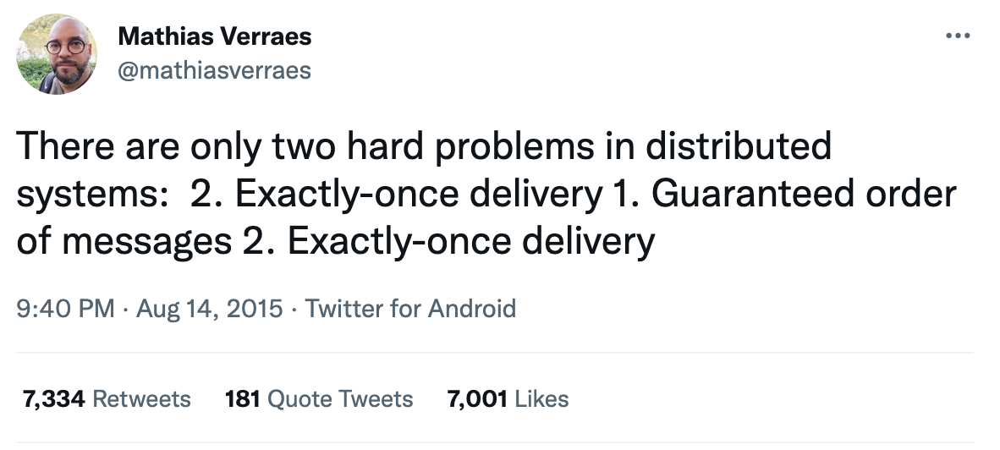

Exactly-once delivery in distributed message queues is admittedly one of the hardest problems in software engineering:

Achieving exactly-once semantics in Apache Kafka Streams is as easy as setting the property `processing.guarantee=exactly_once`. In Apache Kafka this is a [bit more complex](https://kafka.apache.org/documentation/#semantics), one needs to use the transactional producer but also design consumer logic in a specific way to support exactly-once delivery.

Amazon SQS is a fully managed message queue service. It's available in two flavors:
- Standard Queue: it provides at-least once delivery, best-effort ordering and unlimited throughput.
- FIFO Queue: it has throughtput limitations (up to 30k messages per second) but guarantees correct message ordering. The eye-catching feature of FIFO queue is its claim to [exactly-once processing](https://aws.amazon.com/sqs/features/):
> Exactly-Once Processing: A message is delivered once and remains available until a consumer processes and deletes it. Duplicates aren't introduced into the queue.

This claim immediately caught my attention since it's a quite bold claim. I delved into AWS SQS docs for more details. In its [developer guide](https://docs.aws.amazon.com/AWSSimpleQueueService/latest/SQSDeveloperGuide/FIFO-queues-exactly-once-processing.html) dedicated to exactly-once processing it says the following:
> Unlike standard queues, FIFO queues don't introduce duplicate messages. FIFO queues help you avoid sending duplicates to a queue. If you retry the SendMessage action within the **5-minute** deduplication interval, Amazon SQS doesn't introduce any duplicates into the queue.

The first thing to note here is the word __processing__. While Apache Kafka and Apache Kafka Streams offer __exactly-once delivery__ AWS SQS offers __exactly-once processing__. The second caveat is that according to AWS SQS own docs:
> If you retry the SendMessage action within the **5-minute** deduplication interval, Amazon SQS doesn't introduce any duplicates into the queue.

So if SQS FIFO queue producer is down for more than 5 minutes because there's a network issue and the same message is sent again then it actually **will become duplicate**. This certainly means that SQS FIFO queue can't be fully relied on to prevent duplicate messages. If you want to use SQS FIFO queues and your service needs to guarantee that the same message is not processed twice you must implement idemponent processing mechanism. For example, update database with messages that were processed and check database whether new message was already processed before acting on it.

In my opinion SQS docs regarding exactly-once are a bit misleading, what do you think? Feel free to comment here.