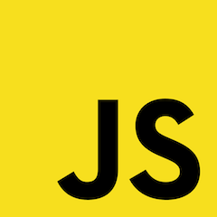

<div style="display:flex;align-items:center;padding-left:10%;padding-right:10%;padding-bottom:50px;">
    <div style="width:30%;">
        
    </div>
        <span style="font-size: 32px;padding-left:16px;padding-right:16px;"> vs </span>
    <div style="width:30%;">
    
    </div>
</div>

I started learning Golang recently and after completing a project I wanted to share some of the first impressions of transitioning from Javascript/Node.js to Go.

1. **Types**. Types are built-in in Go. This is way cooler than Typescript because there's no extra setup effort, all Go libraries are typed so absolutely all of the ecosystem has types. This also means that there's no need for tools like Webpack and build step is so much simpler!

2. **Go modules** are the equivalent to NPM packages. However, Go's package manager is very basic, for example, you can't execute scripts from it. In my project I had to use [make](https://www.gnu.org/software/make/manual/make.html) to launch scripts.

3. **There're no truthy or false values in Go** (similarly to Java). The following code will not compile:

```go
test := 5
if test {
    // ... do something
}
```

4. **Structs in Go are values**, like in C. This means that after passing a struct as function parameter, changing the struct inside that function and returning from the function the struct will not retain the changes:

```go
package main

import (
	"fmt"
)

type test struct {
	number int
}

func change(num test) test {
	num.number = 7
	return num
}

func main() {
	num := test{ 5 }
	change(num)
	fmt.Println(num.number) // prints 5
}
```

This is because function parameters are copied by value and structs are values in Go. In case you want to mutate a struct from inside another function it should be passed as a pointer. Passing struct as a pointer is also preferred if the struct is big so that all of its fields are not copied.

5. **Exports start with a capital letter**. I really liked this Go feature because it's so simple and straightforward as opposed to Javascript where first of all there're two export styles (CommonJS and ES6) and you need to both export and import a variable/function. In Go just name a variable or a function you want to export with a capital letter and it will automatically be available to other packages.

6. **Functions can return tuples**. This is nice but is mostly used to return a result and an error (which is [kind of like](http://callbackhell.com) Javascript callbacks having a result and error parameters).

7. **Defer** statement. Simply put: "A defer statement defers the execution of a function until the surrounding function returns." - [Go tour](https://tour.golang.org/flowcontrol/12). This is nice in terms of developer self-discipline: immediately after you allocate a resource you add a `defer` statement to clean up the resource when it's not needed anymore, but takes some time to get used to. Specifically to the fact that `defer` statements are executed in [LIFO](<https://en.wikipedia.org/wiki/Stack_(abstract_data_type)>) order.

8. **const** has different meaning in Go. In Javascript `const` is used to tell the compiler that a variable can't be re-assigned to. However, in Go **const** can only be used with scalar types and has a bit different [role](https://blog.golang.org/constants).

9. **Go also supports closures**.

10. **There's no `this` in Go**. Go doesn't have classes but methods can be assigned to types via method receivers. At first it's a bit strange but you quickly get used to it.

11. **Arrays are deep-copied when assigned to another array**. For example:

```go
package main

import (
	"fmt"
)

func main() {
	arr1 := [3]int{1,2,3}
	arr2 := arr1
    arr1[0] = 5
    fmt.Println(arr1) // prints [5 2 3]
	fmt.Println(arr2) // prints [1 2 3]
}
```

Most of the time this is not desired so instead slices can be used, which are similar to arrays and can be thought of as "views" of an array. One of the nicest features of arrays and slices is that you can easily create subsets. For example, `arr2[1:2]` is a subset which contains only the second and third element. This is so much more concise than Javascript!

12. **String interpolation**. Go doesn't have [template literals](https://developer.mozilla.org/en-US/docs/Web/JavaScript/Reference/Template_literals) like in Javascript but it has [printf](https://en.wikipedia.org/wiki/Printf_format_string)-style utilities.

13. **Error handling**. Go doesn't have `try/catch`. Instead it's common that functions return error as the second return parameter. Errors can be "thrown" using `panic` function and they can be caught by `recover` function. However, the usage of `recover` is kind of verbose and less intuitive than `try/catch` facility.

14. **Unit-testing**. Go has built-in unit-testing functionality which is really cool. All you need to do is to create a file in the same package you want to test and name it `something_test.go`. Inside that file you just write unit tests which are functions which receive special parameters and Go takes care of the rest. Test suites can then be run from command line via `go test` command.

15. **JSON**. JSON is a first-class citizen in Javascript. Parsing, stringifying and changing JSON is effortless. This simply isn't the case in Go because it's a typed language. In order to create JSON objects one can use `map` as an ad-hoc solution but mostly you'll want to create a custom struct and declare all the necessary fields. In the latter case all fields must start with capital letter because they must be exported so that `json` package can access them. If you want the resulting JSON fields to start with lower-case letter then you can use Go's JSON directives as follows:

```go
type Car struct {
    Wheel int `json:"wheel"`
    WindShield int `json:"windShield"`
}
```

---

## Overall Impression

I didn't mention all of the differences of course because there're a lot of them (concurrency model, pointers etc.). However, the overall impression is that Go is a very friendly language. It's simple on purpose both in terms of its syntax and in terms of the features that it doesn't have (e.g. classes, inheritance). Pointers handling is greatly simplified in comparison to C (there's no pointer arithmetic and there's automatic pointer dereference). The standard library is quite comprehensive. I felt that debugging and build work out of the box as opposed to always having some kind setup in Javascript/Node.js which involves Babel.js or Webpack + Babel.js. Types are built-in and there's automatic type inference.

I immediately missed Javascript JSON handling, destructuring and template literals though. Also having to write `== nil` or `!= nil` in order to check for nullness is kind of a nuissance (in Go you have write `if someVariable != nil { ... }` instead of just `if (someVariable) { ... }` in Javascript). For me most of the learning curve was spent on goroutines and channels which are Go concurrency facilities. Yet in my opinion the advantages of Go far outweigh its drawbacks. I would happily switch to Go for server-side projects at work if I could.
