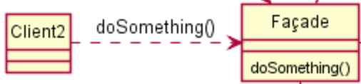

1. [What Is Architecture Testing?](#what-is-architecture-testing)
2. [How ArchUnit Works?](#how-archunit-works)
3. [Common Use Cases](#common-use-cases)
    1. [Classes With a Certain Name Reside In Certain Package](#classes-with-a-certain-name-reside-in-certain-package)
    2. [Classes Are Not Allowed To Use Other Classes](#classes-are-not-allowed-to-use-other-classes)
    3. [Cycles Between Packages Are Not Allowed](#cycles-between-packaged-are-not-allowed)
4. [Architecture Metrics](#architecture-metrics)
5. [Testing Layer/Onion/Hexagonal Architecture](#testing-layer-onion-hexagonal-architecture)
6. [Incremental Rules Adoption](#incremental-rules-adoption)
7. [Rules Generation Based On PlantUML Diagram](#rules-generation-based-on-plantuml-diagram)
8. [Summary](#summary)

### <a name="what-is-architecture-testing"></a>What Is Architecture Testing?
All of us are familiar with unit/integration/end-to-end testing. There's one more area of testing that we can add: architecture testing which will verify that a project conforms to certain architecture rules, for instance:
- how do we enforce that model layer doesn't use low-level infrastructure utilities?
- how circular dependendencies are prevented?

and the list goes on.

Not a lot of projects have such artchitecture rules in the first place. Often times developers find themselves racing fast to complete proof of concept projects or deadlines such that having to enforcing a certain architecture style is a luxury they cannot afford. That being said as the project grows it's crucial to have defined project structure else it becomes harder to find components, to refactor and as a result project velocity suffers.

Enter [ArchUnit](https://www.archunit.org/) for JVM applications which [aims](https://www.archunit.org/motivation) to bring and enforce structure in projects. While there're other projects in this area like [AspectJ](https://www.eclipse.org/aspectj/), [Checkstyle](https://checkstyle.sourceforge.io/) or [FindBugs](https://findbugs.sourceforge.net/) according to [ArchUnit](https://www.archunit.org/motivation):
> each of those tools also has some limitations you might run into, if your rules become more complex. This might be as simple as not being able to specify a pointcut to only apply to interfaces in AspectJ or no back references within pointcuts. Other tools are not even able to define complex rules, like AspectJ allows, at all. Furthermore, you might need to learn a new language to specify the rules, or need different infrastructure to evaluate them.

### <a name="how-archunit-works"></a>How ArchUnit Works?
ArchUnit works by analyzing Java [bytecode](https://www.archunit.org/userguide/html/000_Index.html#_introduction) and building a [graph](https://www.archunit.org/userguide/html/000_Index.html#_domain) which represents a project structure. Essentially, we can add tests which call ArchUnit APIs to verify that the project structure conforms to the rules which were defined. For example, given the following Maven project:
```
.
|-- pom.xml
|-- src
|   |-- main
|   |   `-- java
|   |       `-- example
|   |           `-- order
|   |               `-- Order.java
```
the below JUnit 5 test checks that all classes whose name contains the word `Order` reside in `order` <a name="name-example"></a>package:
```java
    @Test
    public void orderRelatedEntitiesResideInOrderPackage() {
        // Arrange
        JavaClasses importedClasses = new ClassFileImporter().importPackages("example");
        ArchRule rule = classes().that().haveNameMatching(".*Order.*")
                .should().resideInAPackage("..order..")
                .as("Order related entities should reside in package order");

        // Assert
        rule.check(importedClasses);
    }
```

### <a name="common-use-cases"></a>Common Use Cases
Below are some common checks that can be performed using ArchUnit. It's worth mentioning that it has direct integration with JUnit however it can be used standalone as well.

#### <a name="classes-with-a-certain-name-reside-in-certain-package"></a>Classes With a Certain Name Reside In Certain Package
Making sure that classes with a certain name reside under certain packages as in the example [above](#name-example).

#### <a name="classes-are-not-allowed-to-use-other-classes"></a>Classes Are Not Allowed To Use Other Classes
```java
    @Test
    public void orderShouldNotUseDatabaseConfiguration() {
        // Arrange
        JavaClasses importedClasses = new ClassFileImporter().importPackages("example");
        ArchRule rule = noClasses().that().resideInAPackage("..order..")
                .should().accessClassesThat().haveNameMatching(".*DatabaseConfiguration.*")
                .as("Order entities should not use DatabaseConfiguration directly");

        // Assert
        rule.check(importedClasses);
    }
```

#### <a name="cycles-between-packaged-are-not-allowed"></a>Cycles Between Packages Are Not Allowed
```java
    @Test
    public void noCyclesBetweenPackages() {
        // Arrange
        JavaClasses importedClasses = new ClassFileImporter().importPackages("example");
        SliceRule sliceRule = SlicesRuleDefinition.slices().matching("..example.(*)..")
                .should().beFreeOfCycles()
                .as("There should be no cyclic dependencies between packages");

        // Assert
        sliceRule.check(importedClasses);
    }
```
As you can see ArchUnit allows to define powerful checks with relative ease. More use cases can be found [here](https://www.archunit.org/userguide/html/000_Index.html#_what_to_check).

### <a name="architecture-metrics"></a>Architecture Metrics
Interestingly, certain architecture aspects can be measured with several approaches existing to this end. ArchUnit provides implementations of several such [measurements](https://www.archunit.org/userguide/html/000_Index.html#_software_architecture_metrics):
- cumulative dependency metrics by John Lakos
- component dependency metrics by Robert C. Martin
- visibility metrics by Herbert Dowalil

For example, with [cumulative dependency metrics](https://www.archunit.org/userguide/html/000_Index.html#_cumulative_dependency_metrics_by_john_lakos) by John Lakos the basic idea of such measurement is to
> calculate the `DependsOn` value for each component, which is the sum of all components that can be transitively reached from some component including the component itself.

Such measurement can provide interesting insights into a project. Below is an example test which calculates cumulative dependency metrics:
```java
    @Test
    public void johnLakosArchitectureMetrics() {
        JavaClasses classes = new ClassFileImporter().importPackages("example");
        Set<JavaPackage> packages = classes.getPackage("example").getSubpackages();
        MetricsComponents<JavaClass> components = MetricsComponents.fromPackages(packages);
        LakosMetrics metrics = ArchitectureMetrics.lakosMetrics(components);

        System.out.println("CCD: " + metrics.getCumulativeComponentDependency());
        System.out.println("ACD: " + metrics.getAverageComponentDependency());
        System.out.println("RACD: " + metrics.getRelativeAverageComponentDependency());
        System.out.println("NCCD: " + metrics.getNormalizedCumulativeComponentDependency());
    }
```
### <a name="testing-layer-onion-hexagonal-architecture"></a>Testing Layer/Onion/Hexagonal Architecture
[jMolecules](https://github.com/xmolecules/jmolecules#ideas-behind-jmolecules) is another project which aim is to:
> explicitly express architectural concepts for easier code reading and writing.

It provides a set of Java annotations to express various architecture concepts e.g. `@DomainLayer`/`ApplicationLayer` etc. annotations. We can perform powerful architecture checks when combining jMolecules and ArchUnit for example, we can leverage [jMolecules ArchUnit integration](https://github.com/xmolecules/jmolecules-integrations/tree/main/jmolecules-archunit) in order to test that a project conforms to layer/onion or hexagonal architecture:
```java
    @Test
    public void projectConformsToLayerArchitecture() {
        // Arrange
        JavaClasses classes = new ClassFileImporter().importPackages("example");

        // Act
        EvaluationResult evaluation = JMoleculesArchitectureRules.ensureLayeringStrict().evaluate(classes);

        // Assert
        Assertions.assertFalse(evaluation.hasViolation());
    }
```

### <a name="incremental-rules-adoption"></a>Incremental Rules Adoption
If ArchUnit is introduced in an existing big and established project the amount of rules violations will probably be very high to fix them initially. Therefore, ArchUnit provides a handy [feature](https://www.archunit.org/userguide/html/000_Index.html#_freezing_arch_rules) to record all existing violations and start enforcing rules only for the code added after the point in time ([by default](https://www.archunit.org/userguide/html/000_Index.html#_configuration) the list of existing violations is written to a file which can be added to source control).

### <a name="rules-generation-based-on-plantuml-diagram"></a>Rules Generation Based On PlantUML Diagram
Another cool ArchUnit feature is that it can automatically [generate](https://www.archunit.org/userguide/html/000_Index.html#_plantuml_component_diagrams_as_rules) rules based on a PlantUML diagram. For example, given the following diagram



if `Facade` class uses `Client2` it will be reported as violation.

### <a name="summary"></a>Summary
ArchUnit is a great tool to enforce software projects architecture by simply defining tests. It allows to define both intuitive and relatively simple rules as well as more complex ones. Its learning curve is not steep and it doesn't require special compilers like AspectJ for example. When used in combination with jMolecules it allows to check for even more archtitecture styles. To see more examples of tests possible with ArchUnit check out this [repo](https://github.com/TNG/ArchUnit-Examples/tree/main/example-junit5/src/test/java/com/tngtech/archunit/exampletest/junit5).


