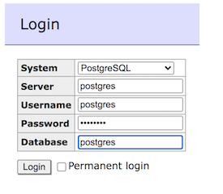

<div style="display:flex;justify-content:center;padding-right:10%;padding-bottom:50px;padding-top:30px;">
  <div style="width:300px;">
    
  </div>  
</div>

Sometimes data needs to be ranked according to top-n entities. For example, a company wants to find out its top 5 products per each county the products are sold. If all the products data resides in a single SQL database and the dataset is small then a single groupwise query can be run within the database. However the dataset can be quite large so that the cost of running such query can be prohibitive in a production environment. In addition the source of the data may be other than a database e.g.: a message queue. In such cases a processing engine like [Apache Flink](https://flink.apache.org) can be used. In this post I will show how to set up such processing pipeline with the help of **only 3** (🔥) Flink SQL commands.

The pipeline will consume from a Kafka topic and output the result to a Postgres table. The input data will contain country and product information, where each Kafka message is sent after the product was bought. The results will be summarized in a table which will have 3 columns: country, product, purchases.

Flink has [several API layers](https://nightlies.apache.org/flink/flink-docs-release-1.14/docs/concepts/overview/) the most high level of which uses familiar SQL syntax while the SQL commands are run via its embedded SQL client, therefore there's no need for even a line of Java/Scala code.

First we need to set up a Flink application cluster. By default official Flink docker image comes with a limited set of connector. For the demo we'll need a Kafka and JDBC connector as well as Postgres driver therefore we'll extend the official docker image:

```dockerfile
FROM flink:1.14.0
COPY flink-connector-jdbc_2.12-1.14.0.jar /opt/flink/lib/flink-connector-jdbc_2.12-1.14.0.jar
COPY flink-sql-connector-kafka_2.11-1.14.0.jar /opt/flink/lib/flink-sql-connector-kafka_2.11-1.14.0.jar
COPY postgresql-42.3.1.jar /opt/flink/lib/postgresql-42.3.1.jar
```

Place the `docker-compose.yml` in the same folder as the `Dockerfile`:

```yml
version: "2.1"
services:
  jobmanager:
    build:
      context: .
      dockerfile: ./Dockerfile
    ports:
      - "8081:8081"
    command: jobmanager
    container_name: jobmanager
    environment:
      - JOB_MANAGER_RPC_ADDRESS=jobmanager

  taskmanager:
    build:
      context: .
      dockerfile: ./Dockerfile
    depends_on:
      - jobmanager
    command: taskmanager
    container_name: taskmanager
    environment:
      - JOB_MANAGER_RPC_ADDRESS=jobmanager

  kafka:
    image: obsidiandynamics/kafka
    restart: "no"
    ports:
      - "2181:2181"
      - "9092:9092"
    environment:
      KAFKA_LISTENERS: "INTERNAL://:29092,EXTERNAL://:9092"
      KAFKA_ADVERTISED_LISTENERS: "INTERNAL://kafka:29092,EXTERNAL://localhost:9092"
      KAFKA_LISTENER_SECURITY_PROTOCOL_MAP: "INTERNAL:PLAINTEXT,EXTERNAL:PLAINTEXT"
      KAFKA_INTER_BROKER_LISTENER_NAME: "INTERNAL"
      KAFKA_ZOOKEEPER_SESSION_TIMEOUT: "6000"
      KAFKA_RESTART_ATTEMPTS: "10"
      KAFKA_RESTART_DELAY: "5"
      ZOOKEEPER_AUTOPURGE_PURGE_INTERVAL: "0"

  postgres:
    image: postgres:12.7
    container_name: postgres
    ports:
      - 5432:5432
    environment:
      POSTGRES_USER: postgres
      POSTGRES_PASSWORD: postgres
      POSTGRES_DB: postgres

  adminer:
    image: adminer
    ports:
      - 8080:8080
```

The `docker-compose.yml` contains all the required services as well as [adminer](https://hub.docker.com/_/adminer) service which provides a web GUI for Postgres client.

1. We'll create the aggregations table in Postgres using adminer. Go to `localhost:8080` and login (the password is `postgres` as well):



2. Create the table:

```sql
CREATE TABLE IF NOT EXISTS aggregations
(
  country VARCHAR ( 50 ) NOT NULL,
  product VARCHAR ( 50 ) NOT NULL,
  purchases BIGINT NOT NULL,
  PRIMARY KEY (country, product)
);
```

3. The Kafka topic called `purchases` should be created and populated with messages whose values are of JSON format as follows (messages can be created using [kcat CLI utility](https://github.com/edenhill/kcat)):

```json
{
  "country": "some country",
  "product": "some product"
}
```

Finally, we can enter Flink jobmanager docker container in order to interact with its SQL API. Run `docker exec -it jobmanager ./bin/sql-client.sh`. Once inside the Flink SQL shell we need to create a `purchases` table which uses source connector to Kafka:

```sql
CREATE TABLE purchases (
  country STRING,
  product STRING
) WITH (
   'connector' = 'kafka',
   'topic' = 'purchases',
   'properties.bootstrap.servers' = 'kafka:29092',
   'value.format' = 'json',
   'properties.group.id' = '1',
   'scan.startup.mode' = 'earliest-offset'
);
```

Next we create an `aggregations` table which will output the top 3 products by purchase volume to the corresponding Postgres table:

```sql
CREATE TABLE aggregations (
  `country` STRING,
  `product` STRING,
  `purchases` BIGINT NOT NULL,
  PRIMARY KEY (`country`, `product`) NOT ENFORCED
) WITH (
  'connector' = 'jdbc',
  'url' = 'jdbc:postgresql://postgres:5432/postgres?&user=postgres&password=postgres',
  'table-name' = 'aggregations'
);
```

Lastly, we start the processing by running the following query:

```sql
insert into aggregations
SELECT `country`, `product`, `purchases`
FROM (
  SELECT *,
    ROW_NUMBER() OVER (PARTITION BY country ORDER BY `purchases` DESC) AS row_num
  FROM (select country, product, count(*) as `purchases` from purchases group by country, product))
WHERE row_num <= 3;
```

The Flink [Top-N](https://nightlies.apache.org/flink/flink-docs-stable/docs/dev/table/sql/queries/topn/) query which was used above is results updating which means if we select all rows in `aggregations` table in Postgres we will receive the most up to date result of the processing (meaning that if previous product `x` had top amount of purchases but now there're 3 other products which have more purchases than `x` it will disappear from `aggregations` table). It's worth noting that the query above uses [No Ranking Output Optimization](https://nightlies.apache.org/flink/flink-docs-stable/docs/dev/table/sql/queries/topn/#no-ranking-output-optimization) that is the table indeed contains top 3 products by country by purchases volume however the results are not sorted by purchases. However, since the `aggregations` table generally should not be large it can easily be sorted:

```sql
SELECT * FROM aggregations
ORDER BY country, purchases DESC
```

In one of my next posts I will describe how to run a similar aggregation using Flink [Window Top-N](https://nightlies.apache.org/flink/flink-docs-master/docs/dev/table/sql/queries/window-topn/) query which is even cooler!
