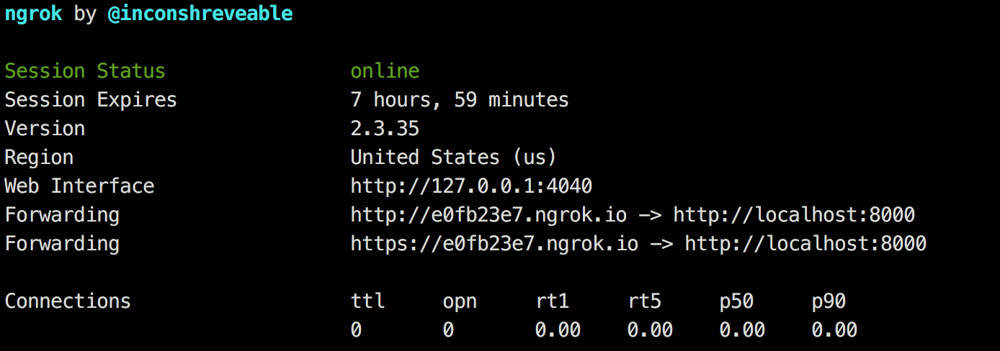

In the times of coronavirus epidemic working remote has become the new norm for many of us. As a software engineer it's import for me to maintain excellent communication with product managers. Sometimes I want to share my work while it's still in intermediate stage to receive feedback or make sure we're on the same page. Specifically, I'm talking about sharing the developement server which runs on `localhost`. This is really handy because it gives the product manager the ability to check out the exact functionality they want to and however they want to.

The solution I'm using is called [ngrok](https://ngrok.com). Simply put, it allows you to expose your `localhost` connection and it's incredibly easy to use! First you download their [client](https://ngrok.com/download). Then you extract the binary `ngrok` and you can run it like so:

```
./ngrok http 8000
```

provided you server runs at `localhost:8000`. This is the command line output you will get:



As you can see from the example you get a secure and non-secure URL which you can then send to anyone and they will be able to access your local development server running on port `8000`.

`ngrok` works by opening an http tunnel essentially but you can read a more in-depth explanation [here](https://github.com/inconshreveable/ngrok/blob/master/docs/DEVELOPMENT.md). You can also open use [auth tokens](https://ngrok.com/docs#getting-started-authtoken) or protect the connection with [password](https://ngrok.com/docs#http-auth).
