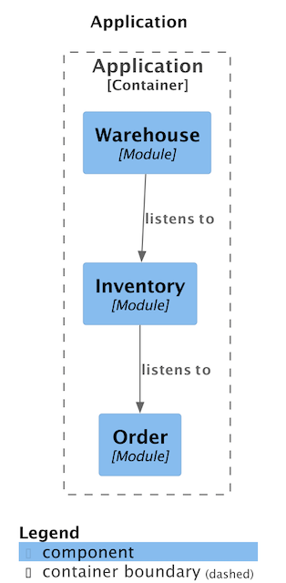
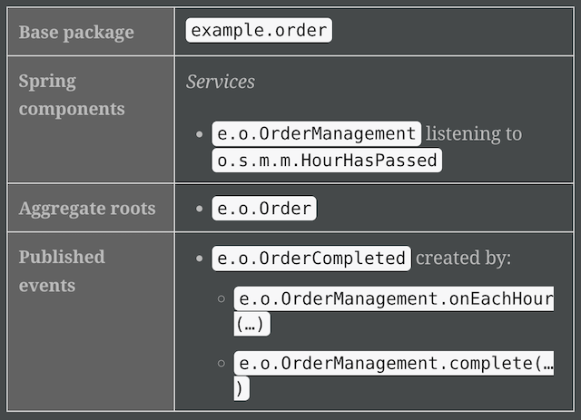
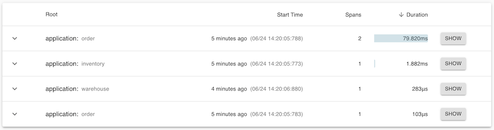

<div style="display:flex;justify-content:center;padding-right:10%;padding-bottom:50px;padding-top:30px;">
    
</div>

1. [What is Spring Modulith?](#what-is-spring-modulith)
2. [Modulith Approach to Application Events](#modulith-approach-to-application-events)
3. [Integration Testing](#integration-testing)
    1. [ApplicationModuleTest Annotation](#applicationModuleTest-annotation)
    2. [Testing Application Events](#applicationModuleTest-testing-application-events)
4. [Passage of Time Events](#passage-of-time-events)
5. [Self-Documentated Modules](#self-documented-modules)
6. [Module Initialization Logic On Startup](#module-initialization-logic-on-startup)
7. [Production-ready Features](#production-ready-features)
      1. [Actuator](#actuator)
      2. [Observability](#observability)
8. [Spring Modulith vs Java 9 Modules](#spring-modulith-vs-java-9-modules)
8. [Summary](#summary)

### <a name="what-is-spring-modulith"></a>What is Spring Modulith?
[Spring Modulith](https://docs.spring.io/spring-modulith/docs/current-SNAPSHOT/reference/html/) is a Spring Boot project which focuses on architectural [best-practices](https://docs.spring.io/spring-modulith/docs/current-SNAPSHOT/reference/html/#fundamentals):

>Spring Modulith supports developers implementing logical modules in Spring Boot applications.

The project aims to provide structure based on [domain-driven design](https://en.wikipedia.org/wiki/Domain-driven_design) principles. It encourages to create Java packages by domain: instead of grouping all controllers under `controllers` folder or all models under `model` folder we're encouraged to have a Java package for orders or users which will contain all the services/controllers/models related to those domains. It's worth noting that Spring Modulith is still in **experimental stage** and depends on Spring Boot 3 which as result means that it requires **JDK 17**. In order to play with the project features follow the [quickstart](https://github.com/spring-projects/spring-modulith#quickstart).

It is beside the scope of the post to argue in favor of the domain-driven structure however a good parallel would be organizing household items in your home: you probably wouldn't have an area of your house dedicated solely to electrical appliances but rather you would have a mixer in the kitchen, a TV in the living room and so on. Below are the main architectural principles of Spring Modulith:

- The project regards an application module as a unit of functionality in a Spring Boot application: it consists of externally exposed interfaces and internal logic.
- By default, each direct sub-package of the main package is considered an application module package. 
- Any sub-package of an application module package is considered to be internal.
- Code of application modules is allowed to refer to types of other application modules.
- Other application modules must not refer to the code within internal packages.

Let's demonstrate the last point by looking at the project <a name="basic-structure"></a>structure below:
```
.
|-- README.md
|-- pom.xml
`-- src
    |-- main
    |   |-- java
    |   |   `-- example
    |   |       |-- Application.java
    |   |       |-- inventory
    |   |       |   |-- InventoryManagement.java
    |   |       `-- order
    |   |           |-- Order.java
    |   |           |-- internal
    |   |           |   `-- OrderInternal.java

```
`Order` uses `OrderInternal` logic, thus `OrderInternal` cannot be package-private and must be made public which unfortunately makes it accessible to other Java packages. This is where Modulith comes in: if some code in `inventory` package refers to `OrderInternal` it will automatically recognize this as architecture violation. In practice this is achieved by adding an integration test:
```java
class ModularityTests {

	ApplicationModules modules = ApplicationModules.of(Application.class);

	@Test
	void verifiesModularStructure() {
		modules.verify();
	}
}
```
Running the above test would fail with the following error message:
```
ModularityTests.verifiesModularStructure:33 ? 
Violations - Module 'inventory' depends on non-exposed 
type example.order.internal.OrderInternal
within module 'order'!
```
Behind the scenes Modulith uses [ArchUnit](https://www.archunit.org/) project to enforce various architectural rules.

By default, any non-internal application module is allowed to use other non-internal application modules. We can restrict even further the module dependencies of another module by using `ApplicationModule` annotation in `package-info.java` file:
```java
@org.springframework.modulith.ApplicationModule(
  allowedDependencies = "order"
)
package example.inventory;
```
The above annotation means that the only module dependency of `inventory` module is `order`.

While it's great to stick to these conventions, in real life the architecture of a project may be more complex and you may need to expose logic from an internal package to another application module. This can be achieved by creating a `package-info.java` file inside that internal package and adding `@org.springframework.modulith.NamedInterface("some-internal-package")`. If we wanted to expose `order.internal` package in the following [project](#basic-structure) we would create the following `package-info.java` file in `order.internal` package:
```java
@org.springframework.modulith.NamedInterface("order-internal")
package example.order.internal;
```
<a name="explicitly-import-module"></a>This would immediately allow to use `OrderInternal` class in `inventory` package. However, in case `inventory` module already had declared explicit dependencies then the internal package would have to be added to those dependencies as follows:
```java
@org.springframework.modulith.ApplicationModule(
        allowedDependencies = {"order", "order::order-internal"}
)
package example.inventory;
```

To summarize, the default rules which are checked for when running `verify()` on `ApplicationModules` are:

- No cycles on the application module level.

- Reference to other non-internal application modules are allowed.

- All references to types that reside in application module internal packages are rejected.

- If explicit dependencies are configured, dependencies to other non-declared application modules are rejected.

It's worth noting that if the default architecture model which comes with Modulith doesn't suit your needs it can be [customized](https://docs.spring.io/spring-modulith/docs/current-SNAPSHOT/reference/html/#fundamentals.customizing-modules).

### <a name="modulith-approach-to-application-events"></a>Modulith Approach to Application Events
Let's take a look at the following example:
```java
@Service
@RequiredArgsConstructor
public class OrderManagement {

  private final InventoryManagement inventory;

  @Transactional
  public void complete(Order order) {
    inventory.updateStockFor(order);
  }
}
```
>The `complete(…)` method creates functional gravity in the sense that it attracts related functionality and thus interaction with Spring beans defined in other application modules. 

This means that in order to test `OrderManagement` its dependencies must be available either as real instances or mocked. Spring events can be used to decouple these dependencies:
```java
@Service
@RequiredArgsConstructor
public class OrderManagement {

  private final ApplicationEventPublisher events;

  @Transactional
  public void complete(Order order) {
    events.publishEvent(new OrderCompleted(order.getId()));
  }
}
```
Above `ApplicationEventPublisher` Spring class is used to publish `OrderCompleted` event which can then be consumed by `InventoryManagement`. By default, Spring events are published [synchronously](https://www.baeldung.com/spring-events#anonymous-events), that is after the event is published it will be consumed in the same thread by a listener. On the one hand this offers a simpler mental model to reason about events, on the other hand the event consumer participates in the original transaction which widens  transaction boundary and increases the chances for the transaction to fail.

The above issue can be mitigated by implementing an asynchronous consumer of application events:
```java
@Component
class InventoryManagement {

  @Async
  @TransactionalEventListener
  @Transactional(propagation = Propagation.REQUIRES_NEW)
  void on(OrderCompleted event) { /* … */ }
}
```
Spring transactions don't propagate to other threads therefore `@Async` allows to execute the event listener as not part of the original transaction. In addition, using `@TransactionalEventListener` allows to perform logic [right after](https://docs.spring.io/spring-framework/docs/current/javadoc-api/org/springframework/transaction/support/TransactionSynchronization.html#afterCompletion(int)) the original transaction has successfully been committed. That is right after the `complete()` method transaction is successfully committed the event listener `on()` method is invoked. Lastly, the event listener itself might need to be transactional hence the `@Transactional` annotation ([explanation of propagation type](https://github.com/spring-projects/spring-modulith/issues/80)). Since there's quite a lot of annotation boilerplate here, Spring Modulith provides `@ApplicationModuleListener` as a subsitute for the above 3 annotations.

Still, there're two more issues with the setup:
- If the listener fails the event is lost.
- The application may crash just before the listener is invoked, so even `try/catch` mechanism inside a listener will not help.

To tackle the above issues Spring Modulith provides [event publication registry](https://docs.spring.io/spring-modulith/docs/current/reference/html/#events.publication-registry) which hooks into Spring event publication mechanism and persists an event for every subscribed listener. In case a listener successfully finishes, the event is persisted with non-null `completion_date`, in case it fails `completion_date` will be null. This allows to implement custom retry mechanisms while by default events whose listeners failed are resubmitted at application startup.

There're currently 3 Modulith event registry starters:
- `spring-modulith-starter-jpa`
- `spring-modulith-starter-jdbc`
- `spring-modulith-starter-mongodb`

Consider the following event:
```java
@Transactional
	public void complete() {
		events.publishEvent(new OrderCompleted(UUID.randomUUID()));
	}
```
with two subscribers:
```java
@Service
@RequiredArgsConstructor
class InventoryManagement {

	private static final Logger LOG = LoggerFactory.getLogger(InventoryManagement.class);

	private final ApplicationEventPublisher events;

	@ApplicationModuleListener
	void on(OrderCompleted event) {
		LOG.info("Received order completion for {}.", event.orderId());
    // ...
	}
}
```
and
```java
@Service
@RequiredArgsConstructor
class UserManagement {

	private static final Logger LOG = LoggerFactory.getLogger(UserManagement.class);

	private final ApplicationEventPublisher events;

	@ApplicationModuleListener
	void on(OrderCompleted event)  {
		LOG.info("Received order completion for {}.", event.orderId());
		throw new RuntimeException("some UserManagement error");
	}
}
```
In this scenario `UserManagement` subscriber fails while `InventoryManagement` succeeds which will result in the following records in `event_publication` table (if `spring-modulith-starter-jdbc` is used):
```
postgres=# select * from event_publication;
-[ RECORD 1 ]----+-----------------------------------------------------------------------
id               | 027f117e-2c8f-411a-a2c2-8786a6f35eea
listener_id      | example.user.UserManagement.on(example.order.OrderCompleted)
event_type       | example.order.OrderCompleted
serialized_event | {"orderId":"4850f124-a14c-4f8d-b13f-ff3db3d2fd9f"}
publication_date | 2023-06-03 11:18:12.173418+00
completion_date  |
-[ RECORD 2 ]----+-----------------------------------------------------------------------
id               | bc5b6526-0e32-4401-80eb-a31e83845797
listener_id      | example.inventory.InventoryManagement.on(example.order.OrderCompleted)
event_type       | example.order.OrderCompleted
serialized_event | {"orderId":"4850f124-a14c-4f8d-b13f-ff3db3d2fd9f"}
publication_date | 2023-06-03 11:18:12.134889+00
completion_date  | 2023-06-03 11:18:13.253296+00
```

### <a name="integration-testing"></a>Integration Testing
#### <a name="applicationModuleTest-annotation"></a>ApplicationModuleTest Annotation

Spring Modulith allows to set up integration tests via `@ApplicationModuleTest` annotation similar to `@SpringBootTest`. However `@ApplicationModuleTest` exposes more functionality, first and foremost, bootstrap modes:
- `STANDALONE` (default) — Runs the current module only.

- `DIRECT_DEPENDENCIES` — Runs the current module as well as imports all modules the current one directly depends on.

- `ALL_DEPENDENCIES` — Runs the current module and imports the entire tree of modules depended on.

This is quite handy because we get these bootstrap modes out of the box as opposed to having to manually create [slices](https://spring.io/blog/2016/08/30/custom-test-slice-with-spring-boot-1-4) in Spring Boot tests.

#### <a name="applicationModuleTest-testing-application-events"></a>Testing Application Events
If the application is event driven it can require considerable effort and testing infrastructure in order to write integration tests. This is especially true if the events are consumed asynchronously. In order to help developers Modulith provides `Scenario` utility which can be consumed as an argument in a JUnit 5 test:
```java
@ApplicationModuleTest
class SomeIntegrationTest {

  @Test
  public void someCheck(Scenario scenario) {
    // test definition here
  }
}
```
A test can be started either using `scenario.stimulate()` or `scenario.publish()` API. As an example let's consider `OrderManagement` class:
```java
@Service
@RequiredArgsConstructor
public class OrderManagement {

	private final @NonNull ApplicationEventPublisher events;

	@Transactional
	public void complete() {
		events.publishEvent(new OrderCompleted(UUID.randomUUID()));
	}
}
```
and the following integration test:
```java
@ApplicationModuleTest
@Import(AsyncTransactionalEventListener.class)
@RequiredArgsConstructor
class EventPublicationRegistryTests {

	private final OrderManagement orders;
	private final AsyncTransactionalEventListener listener;

	@Test
	void inventoryToFulfillOrderIsX(Scenario scenario) throws Exception {

		var order = new Order();

		// Initiate flow by calling stimulate()
		scenario.stimulate(() -> orders.complete(order))
				// wait until inventoryToFulfillOrder becomes not-null/non-Optional
				.andWaitForStateChange(() -> listener.getInventoryToFulfillOrder())
				.andVerify(inventoryToFulfillOrder -> {
					assertThat(inventoryToFulfillOrder).contains("X");
				});
	}

	static class AsyncTransactionalEventListener {

		private static final Logger LOG = LoggerFactory.getLogger(AsyncTransactionalEventListener.class);

		@Getter
		private String inventoryToFulfillOrder;

		@ApplicationModuleListener
		void foo(OrderCompleted event) {
			LOG.info("Received order completion for {}.", event.orderId());

		  // ...
			this.inventoryToFulfillOrder = "inventory X";

			LOG.info("Finished order completion for {}.", event.orderId());
		}
	}
}
```
In the example above `stimulate()` was used to start order management flow waiting for the state changes of `AsyncTransactionalEventListener`. Once the state has changed (`inventoryToFulfillOrder` was initiated to a non-null/non-`Optional` value) `verify()` is called.

For an example of a `scenario.publish()` test consider `InventoryUpdated`, `InventoryManagement` and `OrderManagement` classes. Below is `InventoryUpdated` implementation:
```java
package example.inventory;

import org.jmolecules.event.types.DomainEvent;

public record InventoryUpdated(String inventoryId) implements DomainEvent {}
```
`OrderManagement` implementation:
```java
@Service
@RequiredArgsConstructor
public class OrderManagement {

  private final ApplicationEventPublisher events;

  @Transactional
  public void complete(Order order) {
    events.publishEvent(new OrderCompleted(order.getId()));
  }
}
```

and `InventoryManagement`:
```java
@Service
@RequiredArgsConstructor
class InventoryManagement {

	private final ApplicationEventPublisher events;

	@ApplicationModuleListener
	void on(OrderCompleted event) {

		// ...
		events.publishEvent(new InventoryUpdated(event.orderId()));
	}
}
```
Finally below is a test which checks that `InventoryUpdated` event is published after `OrderCompleted` is fired:
```java
@ApplicationModuleTest(extraIncludes = "inventory")
@RequiredArgsConstructor
class ApplicationTests {

    @Test
    void inventoryUpdatedEventIsPublished(Scenario scenario) {
        Order order = new Order();

        scenario.publish(new OrderCompleted(order.getId()))
                .andWaitForEventOfType(InventoryUpdated.class)
                .toArrive();
    }
}
```
[Earlier](#applicationModuleTest-annotation) it was mentioned that when testing a module which invokes logic from other modules (`OrderManagement` expects `InventoryUpdated` event to be triggered by `InventoryManagement` in the test) we need to set the bootstrap mode in `@ApplicationModuleTest` accordingly. However, note that `OrderManagement` service **doesn't** directly depend on `InventoryManagement`, on the contrary it uses application events. In this case setting mode in `@ApplicationModuleTest(mode = ApplicationModuleTest.BootstrapMode.DIRECT_DEPENDENCIES)` won't help to trigger `InventoryUpdated` event. There're two options to address this:
1. `extraIncludes` parameter can be used as in `@ApplicationModuleTest(extraIncludes = "inventory")`. This will import services from `inventory` package. Multiple extra modules can be declared: `@ApplicationModuleTest(extraIncludes = {"inventory", "user"})`.
2. Adding `@SpringBootTest` and `@EnableScenarios` annotations to a test class.

### <a name="passage-of-time-events"></a>Passage of Time Events
Passage of time events are another interesting feature provided by Spring Modulith. It was inspired by Matthias Verraes [blog post](https://verraes.net/2019/05/patterns-for-decoupling-distsys-passage-of-time-event/).

Imagine having multiple but unrelated pieces of logic which need to be executed each day for example. Instead of creating a CRON job which will run every day for every such piece of logic, the passage of time approach recommends to publish an event: `DayHasPassed` then have all relevant services subscribe to that event. Spring Modulith [provides](https://docs.spring.io/spring-modulith/docs/current/reference/html/#moments) an implementation of passage of time logic by exposing `HourHasPassed`, `DayHasPassed`, `WeekHasPassed`, `MonthHasPassed`, `QuarterHasPassed` and `YearHasPassed` events, just include the following dependency:
```xml
<dependency>
  <groupId>org.springframework.modulith</groupId>
  <artifactId>spring-modulith-moments</artifactId>
</dependency>
```
In addition, if `spring.modulith.moments.enable-time-machine` property is set to `true` then `TimeMachine` bean with `shiftBy` method will be exposed. `shiftBy` allows to forward time which can be a handy utility in integration tests to trigger passage of time-based logic. For instance, suppose we have the following listener:
```java
	@ApplicationModuleListener
	void on(HourHasPassed event) {
		// ...
		events.publishEvent(new OrderCompleted("some_order_id"));
	}
```
We wouldn't want to wait for a whole hour in the integration which would test the above logic, therefore `TimeMachine` can be shifted one hour forward:
```java
	@Test
	void orderCompletedEventIsSent(Scenario scenario) {
		scenario.stimulate(() -> timeMachine.shiftBy(Duration.ofHours(1)))
				.andWaitForEventOfType(OrderCompleted.class)
				.toArrive();
	}
```
### <a name="self-documented-modules"></a>Self-Documentated Modules
What I've always wanted in a project is self-documentation. For example, there's an amazing project [XState](https://xstate.js.org/docs/) available to [Node.js](https://nodejs.org/en) developers which allows to write state machine logic and automatically generates interactive (!) [visualizations](https://xstate.js.org/docs/#visualizer) of the logic.

Spring Modulith automatically generates PlantUML diagram of your application as well as module canvases (module metadata). The below snippet generates both [PlantUML](https://github.com/plantuml/plantuml) diagrams and canvases:
```java
public class DocumentationTests {

    ApplicationModules modules = ApplicationModules.of(Application.class);

    @Test
    void writeDocumentationSnippets() {
        new Documenter(modules)
                .writeModulesAsPlantUml()
                .writeIndividualModulesAsPlantUml()
                .writeModuleCanvases();
        // Or simply: new Documenter(modules).writeDocumentation();
    }
}
```
By default, the documentation will be generated to `target/spring-modulith-docs` in a [Maven](https://maven.apache.org/) project or `build/spring-modulith-docs` in a [Gradle](https://gradle.org/) project. This is how the folder output looks like in my test project which has 3 modules:
```
target/spring-modulith-docs
|-- components.puml
|-- module-inventory.adoc
|-- module-inventory.puml
|-- module-order.adoc
|-- module-order.puml
|-- module-warehouse.adoc
`-- module-warehouse.puml
```
`components.puml` contains all application modules while each module has additional two files: `.puml` which is represents its own diagram of interactions specific just to the module and `.adoc` file which contains metadata about the module. Below is a sample `components.puml` file:


A sample `order` module canvas might look as follows:



### <a name="module-initialization-logic-on-startup"></a>Module Initialization Logic On Startup
Sometimes there's certain logic that needs to be executed once per module on application startup. Importantly, this logic may need to be executed in certain order: if module `B` depends on module `A` the initialization logic should first be executed in module `A` then in module `B`. In a regular Spring application the order of beans initialization is controlled by Spring beans dependencies graph. However, in an event-based application the order of dependencies is also determined by `listens to` relationship. Therefore, Spring Modulith [provides](https://docs.spring.io/spring-modulith/docs/current/reference/html/#runtime.application-module-initializer) `ApplicationModuleInitializer` interface. First, the following dependency must be added:
```xml
<dependency>
  <groupId>org.springframework.modulith</groupId>
  <artifactId>spring-modulith-runtime</artifactId>
  <scope>runtime</scope>
</dependency>
```
next, the initializer class can implement the interface as follows:
```java
@Component
public class InventoryInitializer implements ApplicationModuleInitializer {

    @Override
    public void initialize() {
        // ...
    }
}
```
Spring Modulith [guarantees](https://docs.spring.io/spring-modulith/docs/current/reference/html/#runtime.application-module-initializer) that such initializers will be called in the same order as in application module dependency structure.

While to some this feature will remind Golang `init()` [function](https://go.dev/doc/effective_go#init) which is called before any other logic in its package, it's important to point out that Spring Modulith does not guarantee to run the initializer before the constructor of other Spring beans in a given module. It's only guaranteed that a module's initializer will be run after the initializers of its modules dependencies.

### <a name="production-ready-features"></a>Production-ready Features
#### <a name="actuator"></a>Actuator
Spring Modulith extends [Spring Boot actuator](https://docs.spring.io/spring-boot/docs/current/reference/html/actuator.html#actuator.enabling) with an additional [endpoint](https://docs.spring.io/spring-modulith/docs/current/reference/html/#production-ready.actuator) `/application-modules`. The endpoint provides modules metadata information including the list of modules and their dependencies. Below is an example output of the endpoint `http://localhost:8080/actuator/application-modules`:
```json
{
  "order": {
    "displayName": "Order",
    "basePackage": "example.order",
    "dependencies": []
  },
  "inventory": {
    "displayName": "Inventory",
    "basePackage": "example.inventory",
    "dependencies": [
      {
        "types": [
          "EVENT_LISTENER"
        ],
        "target": "order"
      }
    ]
  }
}
```
In order to enable the actuator add these dependencies:
```xml
		<dependency>
			<groupId>org.springframework.experimental</groupId>
			<artifactId>spring-modulith-actuator</artifactId>
			<version>{projectVersion}</version>
			<scope>runtime</scope>
		</dependency>

		<!-- Spring Boot actuator starter required to enable actuators in general -->
		<dependency>
			<groupId>org.springframework.boot</groupId>
			<artifactId>spring-boot-starter-actuator</artifactId>
      <version>{projectVersion}</version>
			<scope>runtime</scope>
		</dependency>
```
#### <a name="observability"></a>Observability
Adding the following dependency:
```xml
		<dependency>
			<groupId>org.springframework.experimental</groupId>
			<artifactId>spring-modulith-observability</artifactId>
			<version>{projectVersion}</version>
		</dependency>
```
will enable observability capabilities. Note that additional dependencies will need to be included based on Spring Boot [recommendation](https://docs.spring.io/spring-boot/docs/current/reference/html/actuator.html#actuator.micrometer-tracing). When playing with the feature I chose to include:
```xml
		<dependency>
			<groupId>io.micrometer</groupId>
			<artifactId>micrometer-tracing-bridge-brave</artifactId>
			<version>1.1.2</version>
		</dependency>

    <!--		for latency reporting-->
		<dependency>
			<groupId>io.zipkin.reporter2</groupId>
			<artifactId>zipkin-reporter-brave</artifactId>
			<version>2.16.4</version>
		</dependency>
```
Spring Modulith will trace each Spring bean method invocation and mark each trace with the name of the application module. A sample trace JSON will look like this:
```json
  {
    "traceId": "6496cef3b37032a5d32c85ca582d855b",
    "id": "d32c85ca582d855b",
    "name": "warehouse",
    "timestamp": 1687604979559445,
    "duration": 236,
    "localEndpoint": {
      "serviceName": "application",
      "ipv4": "10.100.102.4"
    },
    "tags": {
      "module.method": "e.w.WarehouseManagement.on(…)",
      "org.springframework.modulith.module": "warehouse"
    }
  }
```
In [Zipkin](https://zipkin.io/) UI the traces will look as follows:



### <a name="spring-modulith-vs-java-9-modules"></a>Spring Modulith vs Java 9 Modules
JDK 9 release introduced [Java 9 Platform Module System (JPMS)](https://www.oracle.com/corporate/features/understanding-java-9-modules.html) which is an attempt to add higher-level modularity in Java projects. Basically, the feature allows to define:
- a module as a group of packages
- a module's allowed dependencies
- a module's exports
- the services a module consumes/exports
- which other modules are allowed reflection

It's important to note that all Java 9 modules are private by default so every module which wants to depend on/consume some other modules functionality needs to do so explicitly.

In contrast, Spring Modulith base-level application modules (the direct children of the `main` package) are public by default. Only internal modules must be explicitly exported and optionally explicitly [imported](#explicitly-import-module). In addition, Spring Modulith project architecture rules can be [customized](https://docs.spring.io/spring-modulith/docs/current-SNAPSHOT/reference/html/#fundamentals.customizing-modules) to the needs of a specific project. The main difference of course is that Spring Modulith goes much further than to allow project modularity, rather it offers its vision on how to build Java applications effectively and offers the necessary tools:
- advocating domain-driven design
- advocating for event-driven application model and providing the tools to follow this model (both in business logic - including events persistence and testing code)
- providing self-documenting modules
- module initialization logic on startup

### <a name="summary"></a>Summary
I think Spring Modulith is a great attempt at advocating domain-driven design as well as event-driven application model. The project is still experimental however in my opinion it has the potential to become a very useful Spring Boot extension if not its natural evolution. The project offers lots of tools to make developers lives easier like event testing infrastructure and self-documentation among others. Looking forward to see what the future holds for the project.