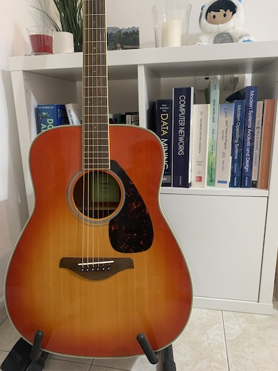

1. [Tip #1 - How To Choose A Guitar](#how-to-choose-guitar)
2. [Tip #2 - How To Learn The Basics of Playing Guitar](#how-to-learn)
3. [Tip #3 - Comparison Between Learning to Code And How To Play Guitar](#comparison)
4. [Tip #4 - Electric Guitar Amplifier and Effects](#effects)
5. [Tip #5 - Big O Notation in Guitar Playing](#big-o)
6. [Tip #6 - The Investment Is Worth It](#investment)
7. [Recommendations](#recommendations)

I usually share programming tips and tricks in this blog because I like building software. However, for the last two years I've had a new passion which is playing guitar. In this post I'd like share my journey to learning guitar while having a full-time job as a software engineer and share several tips which hopefully will prevent you from making the same mistakes I did. **For the record:** I started playing when I was 32 years old, I've been playing for 2 years (1 year with my [teacher](https://www.eladregev.com)), practicing for about 30 minutes every day (started playing since Covid-19).

My first guitar was a classical Yamaha C70. I didn't know the distinction between acoustic and classical guitars back then so I went for the cheapest guitar from a well-known brand.

In retrospect my first guitar was kind of horrible mainly because of its high [action](https://www.sweetwater.com/sweetcare/articles/guitar-setup-part-2-setting-action/) which is the distance between the guitar neck and the strings. Obviously the higher the action the harder one has to press on the strings which makes playing harder.

### Tip #1 - How To Choose A Guitar
When choosing a guitar I greatly recommend going to a guitar store and playing the guitar first to check how comfortable it is and whether you like its sound. Ordering a guitar simply based on online reviews is not a good idea.

#### Type Of Guitar
For a beginner the easiest type of guitar to learn is a classical guitar. It has a wide neck which will make it easier to play chords. Also it has nylon strings which are the easiest on the fingers (metal strings of an acoustic will inflict much more pain).

#### Guitar Action
Cheap guitars for beginners will usually have high action (the distance between guitar neck and the strings), this makes playing harder. Not to worry: go to your local guitar shop and ask them if they can lower the action or can recommend someone (it's called guitar "setup") who can. It will cost about $70-100 (at least here in Israel) and makes a huge difference (I cannot stress this enough)!

Apart from action another important factor is guitar size. The bigger a guitar the harder it is to play it (at least for a beginner). Therefore, I'd recommend to choose a smaller body. In terms of electric guitars I used to try really expensive models in guitar stores and couldn't hear much difference with entry-level ones.

After about a year of playing my classical guitar I bought an acoustic (Yamaha FG 820) and an electric (Kramer Guitars Focus VT-211S - about $125 at [Music Store](https://www.musicstore.com/en_OE/EUR/Kramer-Guitars-Focus-VT-211S-Pewter-Grey/art-GIT0051967-000)). Even after paying import taxes it was still much cheaper to buy the guitar and other equipment from Music Store.

### Tip #2 - How To Learn The Basics of Playing Guitar
There're a lot of Youtube videos where songs are taught however before you start learning songs it's good to learn the proper technique: how to hold your hands when playing for example. I subscribed to a beginner's course from [Guitar Tricks](https://www.guitartricks.com/home) when I just started learning. I liked that the course instructor talked about proper technique and taught the very basics in a structured way so each lesson built on the previous. Later when I started going to a guitar teacher he said my technique was pretty good so I guess Guitar Tricks do a good job. That being said taking lessons from a guitar teacher is much better than any online course. If you can afford it do it. After about a year of online courses I didn't feel I was making much progress so I started taking lessons from a guitar teacher. I started to progress much more quickly. Guitar teachers often teach tricks which allow you to play guitar more easily.

### Tip #3 - Comparison Between Learning to Code And To Play Guitar
I started learning to code at university. Concepts like variables, functions, loops were all new to me. However, after a semester I could write basic simple programs. Every error would take me considerable time to figure out but even the hardest setbacks would take at most a few days to figure out the problem. Therefore, the progress was made each day/week. Learning guitar was very different. Learning to play the most basic chords and transition between them would take months. After a year I could play only a few very easy songs. Whereas the progress in coding is very noticeable learning guitar chords and transitions is a very repetetive process which takes months and certain critical mass was achieved only after two years for me. Only now I start feeling that I can pick up new songs much easier. It now takes me a week or two to learn a new song to a reasonable level while it used to take me several months before. So if you choose to learn guitar be there for the long run.

### Tip #4 - Electric Guitar Amplifier and Effects
If you decide to buy an electric guitar you will need an amplifier. The first amplifier I bought was Marshall MG15FX a very basic model. It sounds very loud even at low volume and the sound itself is not great. I think that's true with many entry-level amplifiers. In addition, you will want to apply effects like distortion when you play hard rock songs. Often a guitar pedal can be bought which produces a certain effect like distortion/chorus etc. Pedals usually start at $50-100 which means that for every effect you'll need to fork out at least $50. In my opinion the best solution to the above problems (entry-level amplifier with good sound + effects) is a multi-effects guitar processor because it functions as both an amplifier and can apply effects. I use BOSS GT-1 which I love. Its amplifier sound is great (you can choose many amplifier sounds in its settings) and it can produce about 100 effects. It's also relatively inexpensive, it costs the sum of an entry-level amplifier and 1 effect so you get a really good value for money. You just need to hook it up to your speakers. Such processors often allow to use multiple effects simultaneously and have software which allows to control the processor from a PC.

### Tip #5 - Big O Notation in Guitar Playing
Software engineering puts great emphasis on algortithms and efficiency. I think guitar playing has certain parallels. For example, there're always multiple ways to play the same chord so when you transition between chords it's important to choose the fingerings which allow for faster/easier transitions. From an engineering perspective it's kind of cool to think of the most efficient combination of fingerings.

### Tip #6 - The Investment Is Worth It
Learning to play guitar at an older age is not easy and took me 2 years until I was relatively comfortable playing the songs I wanted (still not very complicated songs). That being said it's a great gift, the feeling you get when playing a song you love is amazing. The thing to keep in mind is to practice regularly and eventually you will reach a critical mass to be able to play the songs you want. When you look back at this endeavor after 5-10 years you will be so grateful you did it. Who knows with developments like ChatGPT perhaps in 10 years software engineers will not be needed anymore, at least we'll be able to make a living playing in a wedding band.

### Recommendations
In this section I'd like to recommend the people/equipment who/which helped me in my journey:

- [Guitar Tricks](https://www.guitartricks.com/home) - the online course I took where I learned the very basics.
- [Elad Regev](https://www.eladregev.com) - my amazing guitar teacher.
- [Herzl Raz](https://razguitars.business.site) - luthier who did the "setup" on my guitar.
- [Music Store](https://www.musicstore.com/en_OE/EUR) - online guitar store where I ordered my electric guitar.
- [My amplifier + effects processor](https://www.boss.info/global/products/gt-1/)